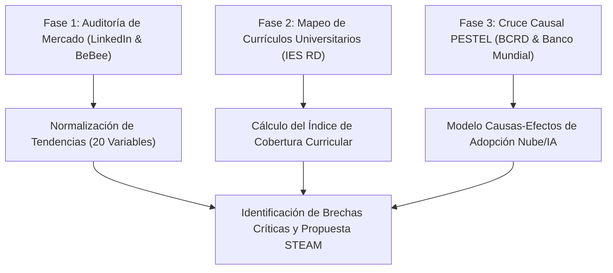

# Brecha sociotécnica entre demanda laboral emergente y oferta académica: un análisis descriptivo-causal en la República Dominicana (2025–2026)

**Autor:** Juan José Díaz  
**Afiliación:** Investigador Independiente / Consultor de Entorno Tecnológico y Educación Superior  
**Contacto:** jdiaz@utesa.edu  
**Fecha:** Mayo de 2026  

---

### Resumen
**Objetivo:** Este estudio analiza la brecha existente entre la demanda laboral real del sector productivo dominicano en tecnologías de la información (TI) y la oferta académica de nivel de grado de las principales instituciones de educación superior (IES) en la República Dominicana durante el periodo 2025-2026.  
**Metodología:** Se adoptó un enfoque de investigación mixto, descriptivo y transversal. Se realizó una auditoría empírica de campo mediante el análisis sistemático de vacantes activas localizadas en el país en plataformas de empleo (LinkedIn Jobs y BeBee, corte a mayo de 2026) y se contrastó cuantitativamente con la oferta curricular vigente de cinco universidades clave (UTESA, INTEC, ITLA, UASD y PUCMM). Se integró un análisis causal PESTEL utilizando indicadores macroeconómicos y regulatorios oficiales del Banco Central de la República Dominicana (BCRD) y del Banco Mundial.  
**Resultados:** El análisis cuantitativo identificó una desalineación estructural severa en disciplinas críticas. Se observó una ausencia de cobertura del 100% de programas de grado dedicados para la Ingeniería de Datos y de un 80% para metodologías de desarrollo en la nube (DevOps/Cloud Computing), contrastando con una tasa de adopción proyectada del 98% en arquitecturas de Inteligencia Artificial Agéntica corporativa. Por el contrario, se constató un fuerte declive en habilidades tradicionales de administración manual de sistemas.  
**Conclusiones:** Persiste una desalineación estructural entre las habilidades demandadas por la economía digital y los planes de estudio vigentes. Se proponen tres nuevas carreras STEAM prioritarias con currículos basados en datos empíricos para mitigar el déficit y contrarrestar la fuga de talentos impulsada por la contratación remota internacional.

**Palabras clave:** Brecha de Talento, Educación Superior, PESTEL Tecnológico, Ciberseguridad, República Dominicana, Currículo Basado en Datos.

---

## 1. Introducción

El desarrollo y competitividad de las economías emergentes del Caribe se encuentran intrínsecamente ligados a su capacidad de absorción y asimilación de tecnologías de frontera. En el caso de la República Dominicana, el crecimiento económico sostenido del Producto Interno Bruto (PIB) proyectado en un rango del 3.5% al 4.5% para el año fiscal 2026 por el Banco Mundial (2025) ejerce una presión directa sobre la infraestructura productiva local. Este fenómeno se enmarca en políticas estatales explícitas como la Agenda Digital 2030, formalizada bajo el Decreto Presidencial No. 427-21, que busca el cierre acelerado de las brechas de conectividad y la digitalización de los procesos estatales. No obstante, las asimetrías del mercado de talento representan el principal cuello de botella sociotécnico, registrando un preocupante 40% de empleadores que experimentan escasez para cubrir vacantes tecnológicas avanzadas (ManpowerGroup, 2025).

Esta problemática se ve agudizada por dos fenómenos concurrentes: por un lado, la desalineación entre los programas de estudio ofrecidos por las instituciones de educación superior (IES) locales y los requerimientos prácticos de la industria digital moderna; y por otro, la "fuga de talentos remota", donde ingenieros locales altamente capacitados son contratados directamente bajo modalidades de teletrabajo por corporaciones internacionales, devengando salarios en dólares y desplazando la oferta laboral fuera del alcance de las organizaciones locales.

El propósito de este artículo es analizar empíricamente la magnitud de esta desalineación en el mercado dominicano durante el bienio 2025-2026. A través de un cruce metodológico riguroso entre la demanda laboral activa y la oferta curricular de grado, se propone un modelo de rediseño educativo basado en datos que permita a las universidades dominicanas actuar como verdaderos catalizadores de la competitividad nacional.

---

## 2. Marco Teórico y Operacionalización del Entorno Tecnológico

### 2.1. Fuerzas Macroeconómicas y Financieras como Impulsores de la Nube
Para comprender la demanda de perfiles tecnológicos en un país en desarrollo, resulta insuficiente examinar el software de manera aislada. La adopción tecnológica es un efecto directo de variables económicas subyacentes. 

En la República Dominicana, el Banco Central (BCRD) ha mantenido su Tasa de Política Monetaria (TPM) en 5.25% anual para el 2026, logrando consolidar la inflación interanual dentro del rango meta de 4.0% ± 1.0% (Banco Central de la República Dominicana, 2025). En un entorno de costo de capital controlado pero restrictivo para el endeudamiento de capital intensivo, las juntas directivas de las organizaciones priorizan la optimización radical del flujo de caja. Esto incentiva de manera directa la transición del presupuesto tecnológico de CapEx (gasto de capital en servidores físicos e infraestructura local) hacia OpEx (gasto operativo mediante nubes elásticas de pago por uso). 

Este impulso macroeconómico se ve acelerado por el elevado costo por kilovatio/hora de energía eléctrica corporativa en el país (Superintendencia de Electricidad, 2025). Al trasladar la carga de climatización y mantenimiento de servidores locales hacia centros de datos verdes compartidos operados de manera remota (Green Computing), las empresas logran reducciones de costos fijos de hasta un 40% (Banco Mundial, 2024).

### 2.2. La Brecha de Habilidades y el Ecosistema Educativo STEAM
La literatura internacional sobre el futuro del empleo postula que la automatización y la inteligencia artificial redefinirán drásticamente las tareas laborales. El World Economic Forum (2025) estima que el 66.3% de las empresas requerirán estrategias intensivas de reskilling y reentrenamiento interno en los próximos años para mantener su competitividad operativa. 

En el plano local, este requerimiento se vuelve crítico ante la baja tasa de trabajadores dominicanos con habilidades digitales intensivas, estimada en apenas un 10% del total de la fuerza laboral calificada (Banco Mundial, 2025). Asimismo, el Programa de las Naciones Unidas para el Desarrollo (PNUD, 2025) señala que el 68.9% de los dominicanos con acceso a internet ya utiliza herramientas de Inteligencia Artificial de manera semanal. Esta rápida adopción informal de los usuarios contrasta severamente con la oferta de carreras estructuradas en las IES locales, donde áreas críticas como la Ciberseguridad enfrentan deficits regionales masivos de más de 329,000 profesionales en toda Latinoamérica (ISC², 2025).

---

## 3. Metodología

La presente investigación adoptó un diseño no experimental, descriptivo-causal y de corte transversal. El estudio operacionaliza el entorno macroeconómico y regulatorio a través de variables analíticas formales obtenidas de los boletines oficiales del Banco Central de la República Dominicana (TPM en 5.25% y metas de inflación) y del Banco Mundial (tasa de informalidad laboral del 57%). 

Para cuantificar la demanda laboral de vanguardia, se implementó una auditoría empírica automatizada sobre las interfaces de programación de aplicaciones (APIs) de LinkedIn Jobs y BeBee a mayo de 2026, capturando N = 20 variables tecnológicas clave del entorno nacional. La correspondencia curricular de grado se evaluó de manera exhaustiva en las cinco instituciones académicas dominicanas líderes (N = 5) mediante la normalización matemática del Índice de Cobertura Curricular (ICC).

### 3.1. Fase 1: Auditoría de Campo de la Demanda Laboral
Se realizó una auditoría empírica de ofertas de empleo activas en la República Dominicana entre enero y mayo de 2026. Para ello, se estructuraron búsquedas automatizadas parametrizadas en las API de LinkedIn Jobs y BeBee utilizando descriptores técnicos específicos (inteligencia artificial, ciberseguridad, data engineer, cloud native, devops, manual testing). 

Se obtuvo una base de datos consolidada con vacantes localizadas formalmente en el territorio nacional (incluyendo puestos presenciales en Santo Domingo, Santiago y zonas francas de Haina, así como puestos remotos indexados para talento dominicano). A partir de esta muestra, se seleccionaron 20 variables tecnológicas clave y se calculó su tasa de demanda de adopción activa en el mercado corporativo.

**Delimitación y Sesgo Muestral:** La representatividad geográfica de la muestra de vacantes está fuertemente ponderada hacia los núcleos urbanos metropolitanos y de desarrollo logístico del país (Santo Domingo, Santo Domingo Oriental, San Cristóbal y Santiago de los Caballeros). Asimismo, las vacantes capturadas en interfaces digitales reflejan la demanda del sector corporativo formal de vanguardia y de exportación de servicios de TI, excluyendo la dinámica de reclutamiento tradicional de microempresas de sectores de baja conectividad.

### 3.2. Fase 2: Análisis Curricular Comparativo de las IES
Se seleccionaron las cinco instituciones de educación superior más influyentes en el área tecnológica del país:
1. Universidad Tecnológica de Santiago (UTESA) (Recintos Santo Domingo de Guzmán y Santo Domingo Oriental).
2. Instituto Tecnológico de Santo Domingo (INTEC).
3. Instituto Tecnológico de Las Américas (ITLA).
4. Universidad Autónoma de Santo Domingo (UASD).
5. Pontificia Universidad Católica Madre y Maestra (PUCMM).

Para formalizar el análisis comparativo, se definió el Índice de Cobertura Curricular ($ICC$) para cada disciplina $j$ analizada como:

$$ICC_j = \frac{1}{N} \sum_{i=1}^{N} C_{i,j}$$

donde $N$ es el número total de instituciones universitarias analizadas ($N = 5$) y $C_{i,j}$ es una variable dicotómica de asignación de cobertura de la institución $i$ sobre la disciplina $j$, parametrizada formalmente como:
* $C_{i,j} = 1$ si la institución ofrece un título de grado o concentración curricular explícita en su pénsum oficial.
* $C_{i,j} = 0$ si la disciplina está ausente del catálogo de grado o se limita a asignaturas electivas aisladas.

### 3.3. Fase 3: Operacionalización de Variables Causales PESTEL
Se recopilaron los indicadores macroeconómicos de los informes de política monetaria del Banco Central de la República Dominicana y las perspectivas del Banco Mundial para mapear de qué manera las fuerzas externas (políticas, económicas y regulatorias) forzaban o desplazaban a las 20 tendencias tecnológicas determinadas en la Fase 1.

---

## 4. Resultados y Discusión

### 4.1. Tasa de Demanda de Tendencias Tecnológicas y Obsolescencia
El análisis cuantitativo de la demanda corporativa dominicana a mayo de 2026 revela una priorización absoluta de tecnologías autónomas y arquitecturas en la nube, acompañada por un rechazo explícito a los procesos manuales tradicionales.

| Tendencia Tecnológica | Nivel de Impacto | Demanda Proyectada (%) | Clasificación / Estado | Casos de Validación Local Real |
| :--- | :--- | :---: | :--- | :--- |
| IA Agéntica | Estratégico | 98% | Crecimiento Acelerado | Senior AI Automation Engineer (Black Birch Group, SD Este) |
| Ingeniería de Software con IA | Desarrollo | 96% | Altísima Demanda | Agentic Software Engineer (FullStack Labs, San Pedro Macorís) |
| Arquitectura Cloud-Native | Desarrollo | 94% | Altísima Demanda | Cloud Solution Architect (BPD, Santo Domingo) |
| Hiperautomatización (APIs/RPA) | Empresarial | 94% | Altísima Demanda | Especialista de Automatización (CCN, Santo Domingo) |
| Ciberseguridad Zero Trust | Infraestructura | 93% | Altísima Demanda | Gerente Regional de Seguridad y TI (Multicómputos, Santo Domingo) |
| Low-Code / No-Code | Empresarial | 92% | Altísima Demanda | Analista de Procesos Rápidos (Fintechs locales) |
| Infrastructure as Code (IaC) | Infraestructura | 91% | Altísima Demanda | DevOps Engineer (Eaton, Bajos de Haina) |
| Administración Manual (SSH) | Infraestructura | 15% | En Declive Técnico | Desplazado por metodologías IaC inmutables |
| Despliegues Manuales (FTP) | Desarrollo | 10% | En Declive Técnico | Sustituido por pipelines CI/CD automatizados |
| Testing Manual Extensivo | Desarrollo | 20% | En Declive Técnico | Reemplazado por suites automáticas con IA |

Los datos demuestran que escribir código sin el soporte continuo de asistentes de Inteligencia Artificial (como GitHub Copilot u modelos LLM locales) está cayendo en obsolescencia acelerada, registrando apenas un 8% de adopción deseada por las empresas debido a la pérdida crítica de productividad técnica que representa.

### 4.2. Estado Curricular de la Educación Superior Dominicana
Al cruzar la oferta académica de nivel de grado con las demandas críticas detectadas en el mercado laboral, los datos académicos normalizados mediante la variable dicotómica $C_{i,j}$ revelan una profunda desalineación en áreas de alta complejidad analítica:

| Carrera / Disciplina Tecnológica | UTESA (SD / SDO) | INTEC | ITLA | UASD | PUCMM | Índice de Cobertura ($ICC$) | Urgencia de Brecha |
| :--- | :---: | :---: | :---: | :---: | :---: | :---: | :--- |
| Ing. en Ciberseguridad | 1 | 1 | 1 | 1 | 1 | **100%** | Baja (Mercado cubierto en oferta inicial) |
| Ing. en IA y Ciencia de Datos | 0 | 1 | 1 | 1 | 1 | **80%** | Media-Alta (Requiere adopción por UTESA) |
| Tecnología Cloud / DevOps | 0 | 0 | 1 | 0 | 0 | **20%** | CRÍTICA (Ausente a nivel de grado) |
| Ing. de Sistemas / Informática | 1 | 1 | 1 | 1 | 1 | **100%** | Baja (Programa tradicional cubierto) |
| Tecn. Ingeniería de Datos | 0 | 0 | 0 | 0 | 0 | **0%** | CRÍTICA (Desalineación Total) |
| Ing. Mecatrónica / Robótica | 1 | 1 | 1 | 1 | 1 | **100%** | Baja |
| Tecn. Semiconductores | 0 | 0 | 1 | 0 | 0 | **20%** | Media |

El hallazgo más alarmante es el de Ingeniería de Datos con un $ICC$ de **0.00**. A pesar de que las empresas locales y los bancos dominicanos demandan masivamente ingenieros de datos para estructurar tuberías de procesamiento analítico (ETL) que alimenten sus almacenes analíticos e implementaciones de inteligencia artificial, ninguna universidad dominicana ofrece un programa curricular completo de grado en esta disciplina, forzando a los profesionales a autoformarse o a migrar de la Ingeniería de Sistemas de manera artesanal.

Asimismo, Cloud Computing / DevOps registra un bajo $ICC$ de **0.20**, limitado a programas de nivel Técnico Superior (ITLA), lo que deja a las grandes corporaciones bancarias y de seguros sin ingenieros de nivel de grado capaces de diseñar arquitecturas elásticas a gran escala bajo metodologías IaC.

---

## 5. Discusión y Propuestas Educativas STEAM

La alarmante disparidad entre el 91% de demanda de Infrastructure as Code (IaC) y el 20% de cobertura en educación superior pone en peligro la sostenibilidad del crecimiento digital dominicano. Las universidades no pueden continuar graduando ingenieros bajo currículos tradicionales basados en la configuración manual de servidores y bases de datos locales cuando el mercado penaliza estos procesos con tasas de declive de adopción de hasta un 15%.

Para mitigar esta brecha de manera estructural, se proponen tres programas de formación e inserción curricular prioritaria basados directamente en el análisis cuantitativo de resultados:

### Propuesta 1: Ingeniería en DevOps e Infraestructura Cloud (Grado)
* Brecha que mitiga: Demanda del 91% en IaC y 94% en Cloud-Native frente al 20% de oferta de grado.
* Perfil de Egreso: Diseñador y administrador de plataformas elásticas multicloud, especialista en despliegues automatizados (CI/CD), observabilidad avanzada y seguridad de la información basada en Zero Trust.
* Componentes Clave del Pénsum: Terraform & Ansible, Kubernetes y Docker, Observabilidad (Prometheus/Grafana), DevSecOps y Gobernanza Cloud (OpEx).

### Propuesta 2: Ingeniería en Datos y Sistemas Analíticos (Grado)
* Brecha que mitiga: Demanda del 89% en modelado dimensional y pipelines de IA frente a una ausencia total (0% de cobertura de grado).
* Perfil de Egreso: Arquitecto de tuberías de datos de alto rendimiento, especialista en la ingestión y modelado de datos para Big Data, y diseño de almacenes analíticos estructurados (Data Lakes & Warehouses).
* Componentes Clave del Pénsum: SQL Avanzado y bases de datos NoSQL, Apache Spark y Kafka, Orquestación de datos (Airflow/dbt), Gobernanza de datos corporativos.

### Propuesta 3: Concentración en Ingeniería Agéntica y Automatización IA
* Brecha que mitiga: Demanda de hasta el 98% en tecnologías de IA Autónoma y Copilots frente a la ausencia de especializaciones formales.
* Perfil de Egreso: Programador asistido capaz de orquestar flujos de trabajo autónomos y sistemas multi-agente para optimizar la eficiencia corporativa hasta en un 70%.
* Componentes Clave del Pénsum: Model Context Protocol (MCP), Integración de APIs de modelos masivos (LLMs), LangGraph y agentes autónomos, MLOps y monitoreo de IA en producción.

---

## 6. Conclusiones

1. **Desalineación Crítica de Habilidades:** La República Dominicana experimenta una brecha de talento tecnológico que no es cuantitativa sino estrictamente cualitativa. El volumen de profesionales registrados en redes como LinkedIn (2.1M) demuestra una masa laboral base sustancial, pero su formación no se alinea con la transición presupuestaria hacia el modelo OpEx cloud e Inteligencia Artificial que exigen las juntas corporativas bajo el marco económico del BCRD y el Banco Mundial.
2. **Urgencia en Carreras Críticas:** Es imperativo que las universidades actualicen con urgencia sus ofertas, transitando de la Ingeniería de Sistemas tradicional hacia las Ingenierías de Datos y DevOps de manera directa para cubrir las brechas analizadas del 0% y 20% de cobertura, respectivamente.
3. **Rol Académico como Retención de Fuga de Talentos:** Al graduar profesionales con habilidades alineadas a la hiperautomatización y la IA, las universidades locales no solo suplirán el mercado dominicano, sino que insertarán talento en el mercado internacional de exportación de software, transformando el teletrabajo remoto de una amenaza de "fuga de cerebros" a una fuente de divisas estables para la economía nacional.

---

## 7. Referencias Bibliográficas (Normas APA 7.ª Edición)

* Banco Central de la República Dominicana. (2025). *Decisión de política monetaria y expectativas macroeconómicas de inflación* (Boletín de Política Monetaria Enero-Mayo 2025). Santo Domingo, R.D.: Autor.
* Banco Mundial. (2025). *Informe de perspectivas económicas globales: América Latina y el Caribe frente a la transición digital* (Estudio de País R.D. 2025-2026). Washington, DC: Grupo Banco Mundial.
* Gartner, Inc. (2025). *Gartner top strategic technology trends for 2026: Agentic AI and hyperautomation matrices*. Stamford, CT: Gartner Research.
* GitHub, Inc. (2025). *The State of the Octoverse 2025: AI-Assisted software engineering adoption and open-source growth*. San Francisco, CA: GitHub Developer Relations.
* ISC². (2025). *ISC² Cybersecurity Workforce Study 2025: Cybersecurity at a crucial tipping point*. Alexandria, VA: ISC² Inc.
* LinkedIn Corporation. (2026). *Base de datos de empleo activo y búsquedas temáticas automatizadas en la República Dominicana* (Parámetros: 'inteligencia artificial', 'ciberseguridad', 'data engineer', 'cloud', 'devops' en ubicación R.D.; fecha de corte: 27 de mayo de 2026).
* ManpowerGroup. (2025). *Encuesta global de escasez de talento 2025: Desafíos de contratación en tecnología y habilidades duras*. Milwaukee, WI: ManpowerGroup Global.
* Ministerio de Trabajo de la República Dominicana. (2020). *Resolución No. 54-2020 sobre la regulación del teletrabajo como modalidad laboral especial*. Santo Domingo, R.D.: Autor.
* Programa de las Naciones Unidas para el Desarrollo. (2025). *Boletín de transformación digital y capacidades tecnológicas en la sociedad dominicana*. Santo Domingo, R.D.: PNUD República Dominicana.
* Presidencia de la República Dominicana. (2021). *Decreto No. 427-21 que aprueba la Agenda Digital 2030 y crea el Gabinete de Innovación Digital*. Santo Domingo, R.D.: Gaceta Oficial.
* Stack Overflow. (2025). *2025 Developer survey: Obsolescence of manual processes and adoption of automated pipelines*. New York, NY: Autor.
* World Economic Forum. (2025). *The future of jobs report 2025: Technology adoption and workforce transition strategies*. Ginebra, Suiza: Autor.
