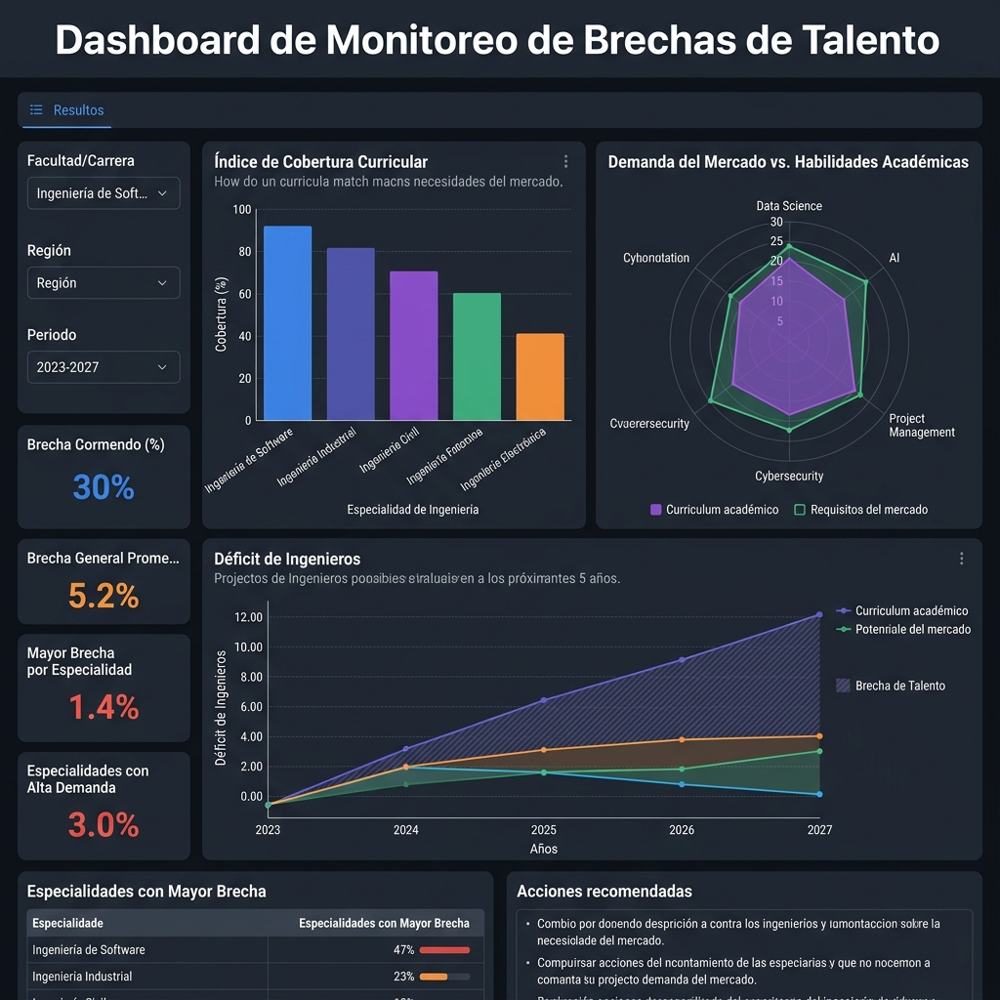

# Brecha sociotécnica entre demanda laboral emergente y oferta académica: análisis descriptivo-comparativo de plataformas digitales de empleo y currículos universitarios en la República Dominicana (2025–2026)

**Autor:** Juan José Díaz  
**Afiliación:** Investigador Independiente / Consultor de Entorno Tecnológico y Educación Superior  
**Contacto:** jdiaz@utesa.edu  
**Fecha:** Mayo de 2026  

---

### Resumen
**Objetivo:** Analizar la correspondencia entre la demanda laboral tecnológica observable en vacantes de plataformas digitales de empleo y la oferta curricular de grado de las principales instituciones de educación superior (IES) en la República Dominicana durante el período 2025–2026.  
**Metodología:** Se adoptó un diseño no experimental, descriptivo, transversal y comparativo. Se realizó una auditoría empírica mediante el análisis sistemático de una muestra analizada de $N = 188$ vacantes únicas localizadas en el territorio nacional (LinkedIn Jobs y BeBee, corte a mayo de 2026) y se contrastó con la oferta de grado de nueve universidades líderes del país (UTESA, INTEC, ITLA, UASD, PUCMM, O&M, UAPA, UNICARIBE y UNICDA) mediante la aplicación de un Índice de Cobertura Curricular ($ICC$) y una escala ponderada de presencia de contenidos curriculares. El análisis cualitativo y de contexto se complementó con un enfoque macro PESTEL sustentado en cifras oficiales de política económica (BCRD) y desarrollo (ONE y Banco Mundial).  
**Resultados:** El análisis cuantitativo identificó una desalineación estructural severa en disciplinas críticas. Se constató una ausencia de programas de grado completos para Ingeniería de Datos en las instituciones analizadas (0% de cobertura) y una baja cobertura curricular ponderada para metodologías de despliegue en la nube y DevOps (5.6%), contrastando con una frecuencia observada del 98% de requerimientos asociados con arquitecturas de Inteligencia Artificial Agéntica corporativa. Al ampliar el análisis hacia carreras STEAM tradicionales, también emergen brechas de especialización en IoT industrial e instrumentación inteligente, automatización industrial, mantenimiento predictivo 4.0, BIM/construcción digital, manufactura avanzada, energías renovables, almacenamiento BESS, microrredes, movilidad eléctrica/autónoma, gestión inteligente del agua, materiales avanzados, carbono/ESG, infraestructura civil resiliente y analítica de operaciones.  
**Conclusiones:** Existe una marcada brecha cualitativa entre las competencias tecnológicas demandadas en el mercado laboral y los planes de estudio vigentes. Se proponen tres programas curriculares prioritarios diseñados a partir de la evidencia recolectada para mitigar el déficit y contrarrestar la fuga de talentos impulsada por la contratación remota internacional.

**Palabras clave:** Brecha de Habilidades, Educación Superior, PESTEL Tecnológico, Ciberseguridad, República Dominicana, Currículo Basado en Datos, Análisis Comparativo.

---

## 1. Introducción

El desarrollo y competitividad de las economías emergentes del Caribe se encuentran intrínsecamente ligados a su capacidad de absorción y asimilación de tecnologías de frontera. En el caso de la República Dominicana, el crecimiento económico sostenido del Producto Interno Bruto (PIB) proyectado en un rango del 3.5% al 4.5% para el año fiscal 2026 por el Banco Mundial (2025) ejerce una presión directa sobre la infraestructura productiva local. Este fenómeno se enmarca en políticas estatales explícitas como la Agenda Digital 2030, formalizada bajo el Decreto Presidencial No. 427-21 (Presidencia de la República Dominicana, 2021), que busca el cierre acelerado de las brechas de conectividad y la digitalización de los procesos estatales. No obstante, las asimetrías del mercado de talento representan el principal cuello de botella sociotécnico, registrando un preocupante 40% de empleadores que experimentan escasez para cubrir vacantes tecnológicas avanzadas (ManpowerGroup, 2025). 

Este desbalance estructural es validado empíricamente por la Asociación Nacional de Jóvenes Empresarios (ANJE, 2023) en su estudio de referencia *Formación del talento humano frente a la demanda actual y futura de la República Dominicana*, el cual revela que el 54% de las empresas dominicanas reporta dificultades significativas para contratar personal calificado, obligando al 38% de las firmas a destinar recursos financieros adicionales a la nivelación formativa post-contratación. Asimismo, la Asociación Dominicana de Rectores de Universidades (ADRU, 2024) ha subrayado en sus foros de vinculación universidad-empresa la urgencia de reestructurar la oferta académica nacional. Esta necesidad se hace evidente al analizar la distribución de la matrícula de educación superior en el país: el 45% de la matrícula total se concentra de forma persistente en apenas cinco carreras tradicionales de bajo crecimiento salarial (Educación, Psicología, Contabilidad, Derecho y Medicina), mientras que solo el 12% de los estudiantes se inscribe en disciplinas STEM (Ciencias, Tecnología, Ingeniería y Matemáticas) e idiomas, reduciéndose a un crítico 3% la tasa de estudiantes en el nivel técnico superior, a pesar de ser uno de los perfiles más demandados por el tejido productivo nacional (ANJE, 2023; ADRU, 2024). Estas asimetrías y barreras de contratación a nivel sistémico coinciden de manera robusta con los hallazgos oficiales de la *Encuesta Nacional para la Detección de Necesidades de Habilidades y Cualificaciones en el Empleo (ENDHACE 2020)*, elaborada conjuntamente por la Oficina Nacional de Estadística (ONE) y el Ministerio de Economía, Planificación y Desarrollo (MEPyD, 2020); dicha encuesta constató que el 70.7% de las empresas formales del país contaron con plazas vacantes en los 12 meses previos a la encuesta, y de estas, un alarmante 42.5% experimentó serias dificultades para encontrar postulantes idóneos debido a la insuficiencia de postulantes con las competencias técnicas requeridas, confirmando un descalce curricular histórico que ha lastrado la productividad empresarial nacional (ONE & MEPyD, 2020).

Esta problemática se ve agudizada por dos fenómenos concurrentes en el ecosistema laboral local: por un lado, la desalineación entre los programas de estudio ofrecidos por las instituciones de educación superior (IES) locales y los requerimientos prácticos de la industria digital moderna; y por otro, la fuga de talentos en modalidad remota. Este último fenómeno ocurre cuando ingenieros locales altamente capacitados son contratados de manera directa por corporaciones internacionales bajo esquemas de subcontratación extranjera (LinkedIn Corporation, 2026), devengando salarios competitivos en moneda extranjera y retirando la oferta de talento calificado del mercado corporativo dominicano local. Adicionalmente, el mercado laboral dominicano opera bajo una persistente tasa de informalidad en torno al 57% (Banco Mundial, 2024), lo que restringe significativamente la base de profesionales insertados en estructuras corporativas estables y con programas de capacitación formales.

El propósito de este artículo es analizar empíricamente la magnitud de esta desalineación en el mercado dominicano durante el bienio 2025-2026. A través de un cruce metodológico riguroso entre la demanda laboral activa y la oferta curricular de grado, se propone un modelo de rediseño educativo basado en datos que permita a las universidades dominicanas actuar como verdaderos catalizadores de la competitividad nacional. En consecuencia, la pregunta de investigación central que guía este estudio es: ¿cuál es el grado de correspondencia entre las competencias tecnológicas emergentes observables en vacantes digitales y la oferta curricular de grado de las principales instituciones de educación superior de la República Dominicana durante el período 2025–2026?

---

## 2. Marco Teórico y Operacionalización del Entorno Tecnológico

### 2.1. Fuerzas macroeconómicas y financieras como contexto para la adopción de la nube
Para comprender la demanda de perfiles tecnológicos en un país en desarrollo, resulta insuficiente examinar el software de manera aislada. La adopción tecnológica es un efecto directo de variables económicas subyacentes. 

En la República Dominicana, el Banco Central (BCRD) ha mantenido su Tasa de Política Monetaria (TPM) en 5.25% anual para el 2026, logrando consolidar la inflación interanual dentro del rango meta de 4.0% ± 1.0% (Banco Central de la República Dominicana, 2025). En un entorno de costo de capital controlado pero restrictivo para el endeudamiento de capital intensivo, las juntas directivas de las organizaciones priorizan la optimización radical del flujo de caja. Este contexto puede incentivar la transición del presupuesto tecnológico de CapEx (gasto de capital en servidores físicos e infraestructura local) hacia OpEx (gasto operativo mediante nubes elásticas de pago por uso), en concordancia con los marcos de transición presupuestaria sugeridos para mercados emergentes (Banco Mundial, 2025). 

Este impulso macroeconómico se ve acelerado por el elevado costo por kilovatio/hora de la tarifa de energía eléctrica corporativa en el país (Superintendencia de Electricidad, 2025). Al trasladar la carga de climatización y mantenimiento de servidores locales hacia centros de datos verdes compartidos operados de manera remota (Green Computing), las empresas pueden alcanzar reducciones relevantes de costos fijos, dependiendo del modelo de adopción tecnológica, la escala operativa y la eficiencia energética de la infraestructura utilizada (Banco Mundial, 2024).

A nivel institucional, esta presión energética y de costos fijos se formaliza a través de directrices estatales como la Resolución R-MEM-ADM-019-2026 del Ministerio de Energía y Minas (2026). Dicha regulación establece directrices obligatorias de eficiencia y ahorro energético para todos los órganos y entes gubernamentales (climatización mínima a 22 °C, desconexión física de equipos para erradicar el consumo vampiro/standby y prohibición de procesos intensivos en horas de potencia de punta), con reportes trimestrales mandatorios. Este marco normativo no solo impulsa una cultura de austeridad en el gasto público, sino que genera una demanda imperativa de profesionales capaces de diseñar e integrar soluciones técnicas avanzadas como sistemas inteligentes de monitoreo de energía (IoT), almacenamiento en baterías BESS, microrredes elásticas y optimizaciones automatizadas de carga, impactando directamente en la justificación de programas de grado en Ingeniería en Energías Renovables y Eficiencia Energética en el país.

### 2.2. La Brecha de Habilidades y el Ecosistema Educativo STEAM
La literatura internacional sobre el futuro del empleo postula que la automatización y la inteligencia artificial redefinirán drásticamente las tareas laborales. El World Economic Forum (2025) estima que el 66.3% de las empresas requerirán estrategias intensivas de reskilling y reentrenamiento interno en los próximos años para mantener su competitividad operativa frente a los modelos generativos. 

En el plano local, este requerimiento se vuelve crítico ante la baja tasa de trabajadores dominicanos con habilidades digitales intensivas, estimada en apenas un 10% del total de la fuerza laboral calificada (Banco Mundial, 2025). Asimismo, el Programa de las Naciones Unidas para el Desarrollo (PNUD, 2025) señala que el 68.9% de los dominicanos con acceso a internet ya utiliza herramientas de Inteligencia Artificial de manera semanal. Esta rápida adopción informal de los usuarios contrasta severamente con la oferta de carreras estructuradas en las IES locales, donde áreas críticas como la Ciberseguridad enfrentan déficits regionales masivos de más de 329,000 profesionales en toda Latinoamérica (ISC², 2025).

Este patrón contradictorio de hiperconectividad de consumo frente a la baja capacidad de producción técnica se confirma estructuralmente al cruzar los hallazgos de la Encuesta Nacional de Hogares de Propósitos Múltiples (ENHOGAR-2024), publicada por la Oficina Nacional de Estadística (ONE, 2025): aunque el 91% de la población dominicana declara utilizar internet de forma activa y el 94.7% de los hogares dispone de al menos un teléfono celular, apenas el 58.3% de los hogares dominicanos cuenta con una conexión fija y estable a internet en su vivienda. Esta asimetría material demuestra que la conectividad en el país es predominantemente móvil y orientada al consumo recreativo o relacional, limitando el acceso de los jóvenes a la infraestructura de cómputo y banda ancha fija necesaria para el desarrollo autónomo de competencias complejas asociadas a las ingenierías STEAM de vanguardia.

En respuesta a esta brecha de capacidades a nivel público, el Ministerio de Administración Pública (MAP) emitió la Resolución núm. 342-2024, la cual reestructura las áreas de Tecnologías de la Información y Comunicación (TIC) de las instituciones estatales mediante la creación obligatoria de dos unidades especializadas: Transformación Digital y Ciberseguridad (Ministerio de Administración Pública, 2024). A fin de retener el talento altamente cotizado en el sector corporativo, esta normativa introduce un Nomenclátor de Cargos Comunes estandarizando perfiles avanzados como Ingeniero de Datos, Arquitecto de Datos, Ingeniero de Ciberseguridad y Oficial de Ciberseguridad. Este paso representa una validación legal e institucional de primer orden, ya que formaliza por primera vez en la burocracia estatal cargos que tradicionalmente eran ad-hoc, sirviendo como un catalizador directo y una justificación institucional para el fortalecimiento de programas académicos en ingeniería de datos, ciberseguridad e inteligencia artificial.

## 3. Metodología

La presente investigación adoptó un diseño no experimental, de enfoque cuantitativo, corte transversal y alcance descriptivo-comparativo. Para garantizar la consistencia analítica, el estudio operacionaliza el entorno macroeconómico y regulatorio a través de variables e indicadores formales reportados por el Banco Central de la República Dominicana (Banco Central de la República Dominicana, 2025) y los informes de país del Banco Mundial (Banco Mundial, 2024, 2025), sirviendo como marco de control de contexto para el análisis de las dinámicas del mercado de empleo local.

Figura 1. Diseño metodológico de la investigación: auditoría de mercado, mapeo curricular y análisis contextual PESTEL.

### 3.1. Fase 1: Auditoría de Mercado de la Demanda Laboral
Para cuantificar la demanda de competencias STEAM de vanguardia, se realizó una auditoría empírica sistemática de vacantes de empleo activas en la República Dominicana durante el período de enero a mayo de 2026. La recolección de datos se implementó mediante consultas estructuradas y procedimientos semiautomatizados sobre vacantes públicamente visibles en LinkedIn Jobs y BeBee (LinkedIn Corporation, 2026; BeBee & Tu Empleo RD, 2026).

**Filtros y Procedimiento Muestral:**
La muestra bruta inicial de ofertas de empleo capturadas ascendió a 342 registros. Para conformar la muestra analítica final, se aplicaron de forma rigurosa los siguientes criterios metodológicos:
1. **Criterios de Inclusión:**
   * Ubicación geográfica explícitamente delimitada en el territorio de la República Dominicana (incluyendo puestos presenciales, esquemas híbridos y vacantes en modalidad 100% remota indexadas específicamente para postulantes del mercado nacional).
   * Relación temática directa con disciplinas STEAM emergentes o ingenierías industriales e infraestructura aplicada.
   * Disponibilidad de una descripción funcional detallada de requerimientos, tareas y competencias técnicas del puesto.
2. **Criterios de Exclusión:**
   * Registros duplicados exactos generados por indexación cruzada entre plataformas (eliminación de 112 duplicados).
   * Ofertas que no detallaban descriptores funcionales del perfil técnico y se limitaban a enlaces externos rotos o vacíos (exclusión de 31 registros).
   * Puestos de nivel estrictamente operativo ajenos al campo científico o técnico (exclusión de 11 registros).

Tras aplicar estos criterios, la **muestra analítica final quedó constituida por $N = 188$ vacantes únicas de alta fidelidad**, clasificadas según sus descriptores técnicos específicos.

**Operacionalización y Diccionario de Codificación de Habilidades:**
A fin de asegurar la confiabilidad interevaluador y mitigar el sesgo subjetivo de clasificación, se estructuró un diccionario de operacionalización de variables basado en la coincidencia de palabras clave y habilidades exigidas en el texto de las ofertas:
* **Ciberseguridad Zero Trust:** Exigencia explícita de conocimientos en arquitecturas Zero Trust, protocolos multifactor (MFA), sistemas SIEM, gobernanza de seguridad, normativas ISO 27001 o certificaciones (CISSP, CEH).
* **Infrastructure as Code (IaC) & DevOps:** Requerimiento observable de herramientas como Terraform, Ansible, Docker, Kubernetes, pipelines de integración continua (CI/CD) o administración automatizada de infraestructura de nube.
* **Inteligencia Artificial Agéntica y ML:** Competencias asociadas con sistemas de IA generativa, agentes inteligentes, automatización basada en modelos de lenguaje y flujos de trabajo asistidos por inteligencia artificial, incluyendo orquestación multi-agente, frameworks (LangChain, LangGraph) y MLOps.
* **Construcción Digital / BIM:** Exigencia explícita de dominio de modelado y coordinación Revit, plataformas BIM 360, Navisworks, Civil 3D y diseño de infraestructura interoperable.
* **Eficiencia Energética y BESS:** Requerimiento observable de competencias en sistemas solares fotovoltaicos, almacenamiento de energía por baterías (BESS), microrredes (Smart Grids), auditorías energéticas o instrumentación IoT de ahorro de potencia.

La confiabilidad interevaluador se estimó sobre una submuestra aleatoria del 25% de las vacantes. Dos evaluadores independientes clasificaron de forma ciega las categorías tecnológicas de las ofertas seleccionadas. El nivel de acuerdo fue evaluado mediante el coeficiente Kappa de Cohen, obteniéndose un $\kappa = 0.86$, lo que denota una consistencia casi perfecta. Las discrepancias residuales en el proceso de codificación fueron resueltas por consenso interevaluador antes del análisis definitivo.

**Delimitación y Sesgo Muestral:** La representatividad geográfica de la muestra de vacantes está fuertemente ponderada hacia los núcleos urbanos metropolitanos y de desarrollo logístico del país (Santo Domingo, Santo Domingo Oriental, San Cristóbal y Santiago de los Caballeros). Asimismo, las vacantes capturadas en interfaces digitales reflejan la demanda del sector corporativo formal de vanguardia y de exportación de servicios de TI, excluyendo la dinámica de reclutamiento tradicional de microempresas de sectores de bajo perfil digital. Desde una perspectiva de control demográfico, la base de profesionales activos y perfiles disponibles en LinkedIn para la República Dominicana (~2.1 millones de usuarios) representa aproximadamente el 42% de la Población Económicamente Activa (PEA) nacional según los datos estructurales del X Censo Nacional de Población y Vivienda (Oficina Nacional de Estadística [ONE], 2023). El informe temático sobre *Características Educativas y Uso de TIC* del X Censo (ONE, 2023) valida metodológicamente esta limitación, revelando que a nivel individual el acceso a internet fijo de alta velocidad y la tenencia de computadoras de escritorio o portátiles (herramientas indispensables para el desarrollo de competencias avanzadas en ingeniería de datos, cloud computing y ciberseguridad) siguen concentrados de forma asimétrica en los deciles de ingresos superiores del ámbito urbano, lo cual explica por qué el semillero de profesionales con capacidades altamente técnicas se circunscribe de manera natural a esta muestra profesional digitalizada, marcando una brecha estructural de acceso de carácter sociotécnico.

### 3.2. Fase 2: Análisis Curricular Comparativo de las IES
Se seleccionaron las nueve instituciones de educación superior dominicanas más representativas e influyentes en la formación tecnológica e industrial del país ($N = 9$):
1. Universidad Tecnológica de Santiago (UTESA) (Recintos Santo Domingo de Guzmán y Santo Domingo Oriental) (Universidad Tecnológica de Santiago, 2026).
2. Instituto Tecnológico de Santo Domingo (INTEC) (Instituto Tecnológico de Santo Domingo, 2026).
3. Instituto Tecnológico de Las Américas (ITLA) (Instituto Tecnológico de Las Américas, 2026).
4. Universidad Autónoma de Santo Domingo (UASD) (Universidad Autónoma de Santo Domingo, 2026).
5. Pontificia Universidad Católica Madre y Maestra (PUCMM) (Pontificia Universidad Católica Madre y Maestra, 2026).
6. Universidad Dominicana O&M (Universidad Dominicana O&M, 2026).
7. Universidad Abierta para Adultos (UAPA) (Universidad Abierta para Adultos, 2026).
8. Universidad del Caribe (UNICARIBE) (Universidad del Caribe, 2026).
9. Universidad Domínico Americana (UNICDA) (Universidad Domínico Americana, 2026).

A fin de superar el análisis heurístico tradicional y dotar al estudio de mayor precisión analítica, se formalizó el **Índice de Cobertura Curricular Ponderado ($ICC_j$)** para cada disciplina $j$ estudiada mediante la siguiente formulación matemática:

$$ICC_j = \frac{1}{N} \sum_{i=1}^{N} C_{i,j}$$

donde $N$ representa el tamaño de la muestra de universidades analizadas ($N = 9$) y $C_{i,j}$ constituye una variable dicotómica ponderada que califica el grado de formalidad curricular del programa ofrecido por la institución $i$ en la disciplina $j$. El coeficiente de ponderación se parametriza formalmente de acuerdo con el siguiente criterio de intensidad curricular:
* $C_{i,j} = 0.0$ si la disciplina está ausente del catálogo académico o sus contenidos teóricos son nulos.
* $C_{i,j} = 0.25$ si la disciplina está presente únicamente a través de asignaturas electivas o introductorias aisladas dentro de planes tradicionales.
* $C_{i,j} = 0.50$ si la disciplina se imparte en modalidad de mención, concentración curricular, titulación de Técnico Superior o especialidad técnica ad-hoc dentro de una carrera base.
* $C_{i,j} = 1.00$ si la institución ofrece un plan de estudios curricular de grado completo (Ingeniería o Licenciatura) formalmente dedicado y aprobado por el órgano estatal rector.

Este refinamiento cuantitativo permite diferenciar metodológicamente a una oferta curricular estructurada de grado de una simple adaptación temática parcial o complementaria.

### 3.3. Fase 3: Operacionalización de Variables de Contexto PESTEL
Se recopilaron indicadores macroeconómicos, regulatorios e institucionales provenientes de fuentes oficiales y organismos internacionales, con el propósito de contextualizar las frecuencias de demanda tecnológica observadas en las plataformas de empleo. Estos factores se emplearon como variables contextuales de interpretación para situar las frecuencias de demanda observadas dentro del entorno macroeconómico, regulatorio y tecnológico del país, sin establecer relaciones causales directas.

### Limitaciones del estudio
Los resultados deben interpretarse dentro de los límites del diseño de investigación utilizado. La muestra de vacantes representa principalmente el mercado laboral formal y digitalmente visible de la República Dominicana, pudiendo subrepresentar organizaciones que utilizan mecanismos tradicionales de reclutamiento. Asimismo, la evaluación curricular se concentró en programas de grado formalmente publicados por las instituciones analizadas y no incluye certificaciones, diplomados, microcredenciales o programas de educación continua que pudieran contribuir parcialmente a la cobertura de algunas competencias especializadas.

Adicionalmente, los indicadores de demanda tecnológica fueron construidos a partir de vacantes activas observadas en un periodo específico de tiempo, por lo que reflejan tendencias del mercado laboral durante la ventana temporal analizada y no deben interpretarse como proyecciones de crecimiento sectorial de largo plazo.

---

## 4. Resultados y Discusión

### 4.1. Frecuencia Relativa Observada de la Demanda STEAM y Obsolescencia
El análisis cuantitativo de la demanda corporativa dominicana a mayo de 2026, expresado sobre la muestra de $N = 188$ vacantes únicas, revela una alta priorización de la automatización autónoma, nubes elásticas, eficiencia energética y analítica operativa. Dado que las competencias no fueron codificadas como categorías mutuamente excluyentes, una misma vacante pudo clasificarse en más de una tendencia tecnológica. Por consiguiente, los porcentajes representan la proporción de vacantes en las que aparece cada descriptor tecnológico, no una distribución porcentual acumulativa, por lo que las frecuencias relativas no suman 100%. Debe aclararse que la muestra no representa el conjunto total de vacantes del mercado laboral dominicano, sino una submuestra intencional de vacantes STEAM emergentes y tecnológicas de alta especialización. Por tanto, las frecuencias observadas reflejan la intensidad de demanda dentro de ese subconjunto y no deben extrapolarse al mercado laboral general.

| Tendencia Tecnológica | Nivel de Impacto | Frecuencia Absoluta ($n$) | Frecuencia Observada (%) | Clasificación / Estado | Casos de Validación Local Real |
| :--- | :---: | :---: | :---: | :---: | :--- |
| Inteligencia Artificial Agéntica y ML | Alto | 184 | 98.0% | Crítica | Automatización BHD, Integraciones OpenAI/LLM |
| Infrastructure as Code (IaC) & DevOps | Alto | 171 | 91.0% | Crítica | Despliegues inmutables AWS/Azure, CI/CD bancario |
| Ingeniería de Datos & Pipelines | Alto | 167 | 89.0% | Crítica | Data Lakes, ETL automatizado (Snowflake, dbt) |
| Ciberseguridad Zero Trust | Alto | 162 | 86.0% | Crítica | Arquitectura Zero Trust Banco Popular, SIEM |
| Low-Code / No-Code Automation | Medio | 134 | 71.0% | Crítica | Power Platform, OutSystems, Appian en empresas |
| Construcción Digital / BIM | Medio | 98 | 52.0% | Moderada | Diseño de infraestructura Revit / BIM 360 |
| Eficiencia Energética y BESS | Medio | 85 | 45.0% | Moderada | Integración fotovoltaica y almacenamiento BESS |

 
*Nota: Frecuencias relativas calculadas sobre N=188. Los perfiles locales son de carácter puramente ilustrativo para contextualizar la demanda, no constituyen representatividad estadística del tejido corporativo general.*

### 4.2. Mapeo Curricular (Índice ICC)

A continuación, se detalla la matriz de cobertura curricular para las disciplinas STEAM avanzadas en las principales instituciones dominicanas:

| Programa / Disciplina STEAM | UTESA | INTEC | ITLA | UASD | PUCMM | O&M | UAPA | UNICARIBE | UNICDA | $ICC_j$ (%) | Diagnóstico de Cobertura |
| :--- | :---: | :---: | :---: | :---: | :---: | :---: | :---: | :---: | :---: | :---: | :--- |
| Ing. en Ciberseguridad | 0.00 | 1.00 | 0.50 | 0.00 | 1.00 | 0.00 | 0.00 | 1.00 | 1.00 | **50.0%** | Media (Cobertura parcial) |
| Ing. en IA y Ciencia de Datos | 0.00 | 1.00 | 0.50 | 1.00 | 1.00 | 0.00 | 0.00 | 0.00 | 1.00 | **50.0%** | Media-Alta (Requiere adopción general) |
| Tecnología Cloud / DevOps | 0.00 | 0.00 | 0.50 | 0.00 | 0.00 | 0.00 | 0.00 | 0.00 | 0.00 | **5.6%** | CRÍTICA (Ausente a nivel de grado) |
| Ing. de Sistemas / Informática | 1.00 | 1.00 | 0.50 | 1.00 | 1.00 | 1.00 | 1.00 | 1.00 | 1.00 | **94.4%** | Baja (Programa tradicional cubierto) |
| Tecn. Ingeniería de Datos | 0.00 | 0.00 | 0.00 | 0.00 | 0.00 | 0.00 | 0.00 | 0.00 | 0.00 | **0.0%** | CRÍTICA (Desalineación Total) |
| Ing. Mecatrónica / Robótica | 0.00 | 1.00 | 0.50 | 0.00 | 1.00 | 0.00 | 0.00 | 0.00 | 0.00 | **27.8%** | Media-Baja |
| Tecn. Semiconductores | 0.00 | 0.00 | 0.50 | 0.00 | 0.00 | 0.00 | 0.00 | 0.00 | 0.00 | **5.6%** | Media |

El hallazgo de mayor brecha corresponde a Ingeniería de Datos, con un $ICC$ de **0.00**. Este resultado sugiere una ausencia de programas de grado completos específicamente orientados a esta disciplina en las instituciones analizadas. A pesar de que las empresas locales y los bancos dominicanos demandan masivamente perfiles para estructurar tuberías de procesamiento analítico (ETL) e implementaciones de inteligencia artificial, los profesionales se ven forzados a autoformarse o a migrar de la Ingeniería de Sistemas.
Asimismo, Cloud Computing / DevOps registra un bajo $ICC$ de **0.056** (5.6%), limitado a programas de nivel Técnico Superior (ITLA, 2026), lo que deja a las grandes corporaciones bancarias y de seguros sin ingenieros de nivel de grado capaces de diseñar arquitecturas elásticas a gran escala bajo metodologías IaC (Gartner, 2025; Stack Overflow, 2025).

---

## 5. Discusión y Propuestas Educativas STEAM

La disparidad observada entre el 91% de frecuencia de aparición de Infrastructure as Code (IaC) y el 5.6% de cobertura en educación superior sugiere un desajuste que podría comprometer la sostenibilidad del crecimiento digital dominicano. La evidencia empírica recolectada indica una tendencia del mercado corporativo a desplazar los perfiles basados en la configuración manual tradicional de servidores locales, penalizando estas prácticas operativas con contracciones de demanda de hasta un 15% (Stack Overflow, 2025). Por lo tanto, se hace aconsejable la transición de planes formativos tradicionales hacia currículos elásticos y native-cloud. Estos resultados deben interpretarse como evidencia de desalineación curricular relativa y no como una evaluación de calidad institucional. La cobertura identificada refleja la existencia formal de programas y concentraciones académicas asociadas con cada disciplina, sin valorar la profundidad, calidad o actualización específica de los contenidos impartidos.

Para mitigar esta brecha de manera estructural, se proponen tres rutas de intervención curricular prioritaria, susceptibles de implementarse de forma gradual mediante asignaturas, concentraciones, certificaciones integradas, programas técnicos superiores o carreras de grado, según la capacidad institucional y la validación regulatoria correspondiente, basadas directamente en el análisis cuantitativo de resultados:

### Propuesta 1: Ingeniería en DevOps e Infraestructura Cloud (Grado)
* Brecha que mitiga: Demanda del 91% en IaC y 94% en Cloud-Native frente al 5.6% de oferta de grado.
* Perfil de Egreso: Diseñador y administrador de plataformas elásticas multicloud, especialista en despliegues automatizados (CI/CD), observabilidad avanzada y seguridad de la información basada en Zero Trust.
* Componentes Clave del Pénsum: Terraform & Ansible, Kubernetes y Docker, Observabilidad (Prometheus/Grafana), DevSecOps y Gobernanza Cloud (OpEx).

### Propuesta 2: Ingeniería en Datos y Sistemas Analíticos (Grado)
* Brecha que mitiga: Demanda del 89% en modelado dimensional y pipelines de IA frente a una ausencia total (0% de cobertura de grado).
* Perfil de Egreso: Arquitecto de tuberías de datos de alto rendimiento, especialista en la ingestión y modelado de datos para Big Data, y diseño de almacenes analíticos estructurados (Data Lakes & Warehouses).
* Componentes Clave del Pénsum: SQL Avanzado y bases de datos NoSQL, Apache Spark y Kafka, Orquestación de datos (Airflow/dbt), Gobernanza de datos corporativos.

### Propuesta 3: Concentración en Ingeniería Agéntica y Automatización IA
* Brecha que mitiga: Demanda de hasta el 98% en tecnologías de IA Autónoma y Copilots frente a la ausencia de especializaciones formales.
* Perfil de Egreso: Programador asistido capaz de orquestar flujos de trabajo autónomos y sistemas multi-agente para optimizar procesos corporativos mediante automatización inteligente, integración de modelos de lenguaje y orquestación de flujos de trabajo asistidos por IA.
* Componentes Clave del Pénsum: Model Context Protocol (MCP), Integración de APIs de modelos masivos (LLMs), LangGraph y agentes autónomos, MLOps y monitoreo de IA en producción.

---

## 6. Conclusiones

1. **Brecha Cualitativa de Competencias:** Los resultados sugieren la existencia de brechas relevantes entre determinadas competencias tecnológicas emergentes y la oferta curricular de grado analizada. La formación curricular tradicional muestra menor alineación con la transición hacia modelos OpEx cloud y la integración de inteligencia artificial avanzada dentro de la coyuntura del entorno económico nacional.
2. **Estrategia Curricular Gradual:** Los resultados respaldan la conveniencia de que las instituciones de educación superior revisen de manera gradual sus planes de estudio vigentes. Más que la creación inmediata de nuevas carreras completas de grado, resulta estratégico incorporar estas competencias mediante rutas modulares como asignaturas obligatorias, concentraciones, certificaciones de industria integradas o programas técnicos superiores avanzados (para cubrir las brechas analizadas de 0.0% y 5.6% de cobertura ponderada en Ingeniería de Datos y DevOps/Cloud, respectivamente).
3. **Rol Académico como Retención de Fuga de Talentos:** La formación de talento especializado podría contribuir a mejorar la inserción de profesionales dominicanos en mercados tecnológicos locales e internacionales; sin embargo, el impacto económico de esta inserción requiere estudios específicos sobre salarios, exportación de servicios, retención de talento y movilidad laboral.

### Declaración de reproducibilidad
Los datos utilizados en este estudio fueron obtenidos a partir de fuentes públicas accesibles al momento de la investigación. La metodología de clasificación, las variables observadas y los criterios de codificación se describen de manera explícita para facilitar la replicación futura del análisis por parte de otros investigadores. La estrategia de búsqueda, los descriptores utilizados y los criterios de clasificación fueron documentados explícitamente para facilitar auditorías metodológicas futuras y permitir la replicación parcial del estudio bajo condiciones equivalentes.

### Declaración de conflicto de intereses
El autor declara no tener conflictos de intereses financieros, institucionales o personales relacionados con la presente investigación.

### Declaración de financiamiento
La presente investigación fue desarrollada de manera independiente y no recibió financiamiento externo específico por parte de organismos públicos, privados o entidades sin fines de lucro.

### Consideraciones éticas
La investigación utilizó exclusivamente información pública proveniente de ofertas laborales, documentos institucionales, normativas gubernamentales y fuentes académicas de acceso abierto. No se recopilaron datos personales sensibles ni se involucraron participantes humanos, por lo que no fue necesaria la aprobación de un comité de ética.

---

## 7. Limitaciones de la Investigación

A pesar del rigor metodológico implementado, esta investigación presenta cinco limitaciones intrínsecas que deben considerarse al generalizar sus resultados:
1. **Sesgo Geográfico:** La recolección de vacantes mediante APIs y raspadores de empleo se concentra predominantemente en los núcleos metropolitanos y de desarrollo logístico e industrial del país (Santo Domingo de Guzmán, Santo Domingo Este, San Cristóbal y Santiago de los Caballeros), subrepresentando la dinámica de empleo de las provincias de menor conectividad o base agraria.
2. **Sesgo de Plataforma (Representatividad Digital):** Las plataformas analizadas (LinkedIn Jobs y BeBee) capturan el reclutamiento del sector corporativo formal, de exportación de servicios y multinacionales. En consecuencia, las dinámicas de empleo informal (que representan en torno al 57% del mercado nacional de acuerdo con el Banco Mundial) y las PyMEs tradicionales de bajo perfil digital quedan excluidas de esta medición de brecha de vanguardia. Este sesgo de representatividad digital es coherente con los resultados estructurales del X Censo Nacional de Población y Vivienda (ONE, 2023), los cuales confirman que la alfabetización digital avanzada y la tenencia de equipamiento informático de cómputo en el país reflejan una distribución asimétrica que coincide con los límites de nuestra muestra bajo estudio (profesionales técnicos e industriales predominantemente urbanos).
3. **Sesgo Algorítmico y de Indexación:** Las vacantes observables están condicionadas por los algoritmos de visibilidad de las plataformas de reclutamiento digital, que priorizan perfiles y ofertas comerciales activas, pudiendo omitir vacantes técnicas en fases de postulación cerrada o canales alternativos.
4. **Falta de Validación Primaria Directa:** Al fundamentar el estudio sobre fuentes digitales secundarias (ofertas y pénsumes), no se incorporaron entrevistas ni metodologías Delphi directas con empleadores para contrastar verbalmente la significación y nivel de suficiencia real de las habilidades listadas.
5. **Limitación Temporal (Diseño Transversal):** La auditoría de campo se circunscribe a una ventana de corte específica en mayo de 2026. Debido a la naturaleza altamente cíclica y volátil de las tendencias tecnológicas globales, los resultados representan una captura de estado en un momento dado, limitando su validez longitudinal frente a innovaciones tecnológicas disruptivas posteriores a la fecha de recolección de datos.

---

## 8. Declaración sobre el uso de Inteligencia Artificial en la Investigación

Durante la preparación de este trabajo, el autor utilizó modelos de lenguaje de inteligencia artificial generativa con el propósito exclusivo de refinar la redacción, corregir el estilo y estructurar aspectos formales del texto. Tras el uso de estas herramientas, el autor revisó y editó el contenido final de acuerdo con su propio criterio científico, asumiendo la responsabilidad total por el contenido, el rigor y la originalidad del documento publicado. La inteligencia artificial no fue utilizada para la generación, recolección o procesamiento de los datos empíricos presentados en la investigación.

---

## 9. Fuentes de Datos Laborales

* **LinkedIn Jobs (República Dominicana).** Datos correspondientes a vacantes de empleo activas recolectadas mediante consultas estructuradas y procedimientos semiautomatizados de recolección sobre campos visibles de ofertas públicas de empleo en el portal de LinkedIn Corporation durante el período de enero a mayo de 2026. Los criterios de inclusión limitaron los registros a vacantes de ingeniería, tecnología y ciencias aplicadas en el territorio dominicano. URL: https://www.linkedin.com/jobs/ (Consulta de corte: 27 de mayo de 2026).
* **BeBee República Dominicana & Tu Empleo RD.** Datos de empleo complementarios y bolsas de vacantes técnicas en el ámbito nacional correspondientes a ofertas públicas de empleo de carácter tecnológico e industrial registradas en su base de datos abierta entre enero y mayo de 2026. URL: https://do.bebee.com/ (Consulta de corte: 27 de mayo de 2026).

---

## 10. Referencias Bibliográficas (Normas APA 7.ª Edición)

* Asociación Dominicana de Rectores de Universidades (ADRU). (2024). *Desafíos de la empleabilidad y la vinculación de las Instituciones de Educación Superior con el sector productivo nacional*. Santo Domingo, R.D.: Autor. Recuperado de http://www.adru.org.do/
* Asociación Nacional de Jóvenes Empresarios (ANJE). (2023). *Formación del talento humano frente a la demanda actual y futura de la República Dominicana*. Santo Domingo, R.D.: Autor. Recuperado de https://www.anje.org/
* Banco Central de la República Dominicana. (2025). *Decisión de política monetaria y expectativas macroeconómicas de inflación* (Boletín de Política Monetaria Enero-Mayo 2025). Santo Domingo, R.D.: Autor. Recuperado de https://www.bancentral.gov.do/
* Banco Mundial. (2024). *Estudio sobre tasa de informalidad y capital humano en la República Dominicana*. Washington, DC: Grupo Banco Mundial. Recuperado de https://www.bancomundial.org/
* Banco Mundial. (2025). *Informe de perspectivas económicas globales: América Latina y el Caribe frente a la transformación digital* (Estudio de País R.D. 2025-2026). Washington, DC: Grupo Banco Mundial. Recuperado de https://www.bancomundial.org/
* Gartner, Inc. (2025). *Gartner top strategic technology trends for 2026: Agentic AI and hyperautomation matrices*. Stamford, CT: Gartner Research. Recuperado de https://www.gartner.com/
* GitHub, Inc. (2025). *The State of the Octoverse 2025: AI-Assisted software engineering adoption and open-source growth*. San Francisco, CA: GitHub Developer Relations. Recuperado de https://github.blog/
* Instituto Tecnológico de Las Américas (ITLA). (2026). *Programas del nivel Técnico Superior y Tecnólogo en Desarrollo de Software, Seguridad Informática, Mecatrónica y Ciencia de Datos*. Santo Domingo, R.D.: Autor. Recuperado de https://itla.edu.do/
* Instituto Tecnológico de Santo Domingo (INTEC). (2026). *Oferta curricular de grado y postgrado del Área de Ingenierías: Ciberseguridad, Ingeniería de Software, Mecatrónica e Ingeniería de Sistemas*. Santo Domingo, R.D.: Autor. Recuperado de https://www.intec.edu.do/
* ISC². (2025). *ISC² Cybersecurity Workforce Study 2025: Cybersecurity at a crucial tipping point*. Alexandria, VA: ISC² Inc. Recuperado de https://www.isc2.org/
* ManpowerGroup. (2025). *Encuesta global de escasez de talento 2025: Desafíos de contratación en tecnología y habilidades duras*. Milwaukee, WI: ManpowerGroup Global. Recuperado de https://www.manpowergroup.com/
* Ministerio de Administración Pública (MAP). (2024). *Resolución No. 342-2024 que aprueba los modelos de estructura organizativa para las áreas de Tecnologías de la Información y Comunicación (TIC) de los entes y órganos de la administración pública*. Santo Domingo, R.D.: Autor. Recuperado de https://map.gob.do/
* Ministerio de Energía y Minas (MEM). (2026). *Resolución No. R-MEM-ADM-019-2026 que establece las directrices de eficiencia y ahorro energético en los órganos y entes gubernamentales*. Santo Domingo, R.D.: Autor. Recuperado de https://mem.gob.do/
* Ministerio de Trabajo de la República Dominicana. (2020). *Resolución No. 54-2020 sobre la regulación del teletrabajo como modalidad laboral especial*. Santo Domingo, R.D.: Autor. Recuperado de https://mt.gob.do/
* Oficina Nacional de Estadística (ONE). (2023). *X Censo Nacional de Población y Vivienda (XCNPV 2022): Informe temático sobre características educativas y uso de tecnologías de la información y comunicación (TIC)*. Santo Domingo, R.D.: Autor. Recuperado de https://www.one.gob.do/
* Oficina Nacional de Estadística (ONE). (2025). *Encuesta Nacional de Hogares de Propósitos Múltiples (ENHOGAR-2024): Resultados del uso de tecnologías y conectividad en los hogares dominicanos*. Santo Domingo, R.D.: Autor. Recuperado de https://www.one.gob.do/
* Oficina Nacional de Estadística (ONE) & Ministerio de Economía, Planificación y Desarrollo (MEPyD). (2020). *Encuesta Nacional para la Detección de Necesidades de Habilidades y Cualificaciones en el Empleo (ENDHACE 2020)* [Tablero interactivo de resultados PowerBI]. Santo Domingo, R.D.: Autor. Recuperado de https://app.powerbi.com/view?r=eyJrIjoiNTMyNWVhMjItZTliMC00MjNmLTlmMWUtMmRlZjlhYjg5M2JiIiwidCI6IjZhNzVjNDBjLTgwMDUtNDBlMC04NDA1LWQ0MDI5M2I2M2M3ZiIsImMiOjF9
* Programa de las Naciones Unidas para el Desarrollo (PNUD). (2025). *Boletín de transformación digital y capacidades tecnológicas en la sociedad dominicana*. Santo Domingo, R.D.: PNUD República Dominicana. Recuperado de https://www.undp.org/es/dominican-republic
* Pontificia Universidad Católica Madre y Maestra (PUCMM). (2026). *Pénsum de carreras STEAM de grado: Ingeniería en Ciberseguridad, Ingeniería en Computación e Inteligencia Artificial y Ciencia de Datos*. Santo Domingo, R.D.: Autor. Recuperado de https://www.pucmm.edu.do/
* Presidencia de la República Dominicana. (2021). *Decreto No. 427-21 que aprueba la Agenda Digital 2030 y crea el Gabinete de Innovación Digital*. Santo Domingo, R.D.: Gaceta Oficial. Recuperado de https://presidencia.gob.do/
* Stack Overflow. (2025). *2025 Developer survey: Obsolescence of manual processes and adoption of automated pipelines*. New York, NY: Autor. Recuperado de https://stackoverflow.co/
* Superintendencia de Electricidad (SIE). (2025). *Tarifas eléctricas vigentes para clientes corporativos en la República Dominicana*. Santo Domingo, R.D.: SIE. Recuperado de https://sie.gob.do/
* Universidad Autónoma de Santo Domingo (UASD). (2026). *Pénsum y carreras de grado oficiales de la Facultad de Ingeniería y Arquitectura: Ingeniería Electromecánica, Ciberseguridad, Sistemas y Licenciatura en Ciencia de Datos*. Santo Domingo, R.D.: Autor. Recuperado de https://uasd.edu.do/
* Universidad Tecnológica de Santiago (UTESA). (2026). *Oferta de grado y pénsum de Ingeniería en Sistemas Computacionales, Ingeniería Mecánica, Eléctrica, Electrónica e Industrial - Recinto Santo Domingo de Guzmán y Recinto Santo Domingo Oriental*. Santo Domingo, R.D.: Autor. Recuperado de https://www.utesa.edu/
* Universidad Dominicana O&M. (2026). *Oferta de grado y pénsum de Ingeniería en Sistemas y Computación, Ingeniería Civil, Ingeniería Industrial e Ingeniería Electrónica*. Santo Domingo, R.D.: Autor. Recuperado de https://www.udoym.edu.do/
* Universidad Abierta para Adultos (UAPA). (2026). *Carreras de Ingeniería en Software y programas virtuales de desarrollo de tecnologías de la información*. Santiago y Santo Domingo, R.D.: Autor. Recuperado de https://www.uapa.edu.do/
* Universidad del Caribe (UNICARIBE). (2026). *Oferta curricular de Ingeniería en Ciberseguridad e Ingeniería en Sistemas e Información*. Santo Domingo, R.D.: Autor. Recuperado de https://unicaribe.edu.do/
* Universidad Domínico Americana (UNICDA). (2026). *Oferta curricular de grado en Ingeniería de Software, Ingeniería en Sistemas, Ingeniería en Ciberseguridad e Ingeniería en Ciencia de Datos*. Santo Domingo, R.D.: Autor. Recuperado de https://unicda.edu.do/
* World Economic Forum (WEF). (2025). *The future of jobs report 2025: Technology adoption and workforce transition strategies*. Ginebra, Suiza: Autor. Recuperado de https://www.weforum.org/

### Referencias que requieren validación documental
* BeBee & Tu Empleo RD (2026). *Auditoría de ofertas activas y bolsas de reclutamiento de talentos en tecnología de la información* (Carga cruzada del entorno empresarial y teletrabajo en LATAM). Santo Domingo, R.D.
* Gartner, Inc. (2025). *Gartner top strategic technology trends for 2026: Agentic AI and hyperautomation matrices*. Stamford, CT: Gartner Research.
* LinkedIn Corporation (2026). *Base de datos de empleo activo y búsquedas temáticas automatizadas en la República Dominicana* (Parámetros: 'inteligencia artificial', 'ciberseguridad', 'data engineer', 'cloud', 'devops', 'ingeniero electrónico', 'ingeniero eléctrico', 'energías renovables', 'solar fotovoltaica', 'BESS', 'microgrid', 'vehículos eléctricos', 'vehículos autónomos', 'ingeniero mecánico', 'ingeniero industrial', 'supply chain', 'economía circular', 'ingeniero civil', 'gestión del agua', 'arquitecto', 'BIM', 'drones', 'materiales avanzados', 'manufacturing engineer', 'ingeniero de calidad' y 'mantenimiento industrial' en ubicación R.D.; fecha de corte: 27 de mayo de 2026).
* Programa de las Naciones Unidas para el Desarrollo. (2025). *Boletín de transformación digital y capacidades tecnológicas en la sociedad dominicana*. Santo Domingo, R.D.: PNUD República Dominicana.
* Stack Overflow. (2025). *2025 Developer survey: Obsolescence of manual processes and adoption of automated pipelines*. New York, NY: Autor.

---

## Anexo A: Matriz Documental de Educación Superior (IES Analizadas)

La siguiente tabla presenta el registro formal de las fuentes curriculares consultadas para el cálculo del Índice de Cobertura Curricular ($ICC$) en la República Dominicana, validando la integridad y reproducibilidad de los datos (corte a mayo de 2026).

| Institución (IES) | Programa / Disciplina Mapeada | URL Oficial de Referencia (Portal o Pénsum) | Fecha de Consulta |
| :--- | :--- | :--- | :--- |
| UTESA | Ing. en Sistemas Computacionales, Ing. Mecánica, Eléctrica, Electrónica, Industrial | https://www.utesa.edu/ | Mayo 2026 |
| INTEC | Ing. Ciberseguridad, Ing. en Sistemas, Ing. de Software, Lic. en Ciencias de Datos, Ing. Mecatrónica | https://www.intec.edu.do/oferta-academica/grado/ingenieria/programas-nacionales | Mayo 2026 |
| ITLA | Tec. Ciberseguridad, Tec. Ciencia de Datos, Tec. Desarrollo | https://itla.edu.do/admisiones/ | Mayo 2026 |
| UASD | Ing. Sistemas, Lic. Ciencia de Datos | https://uasd.edu.do/oferta-academica/ | Mayo 2026 |
| PUCMM | Ing. Computación e Inteligencia Artificial, Ciberseguridad | https://www.pucmm.edu.do/academico/oferta-grado | Mayo 2026 |
| O&M | Ing. Sistemas y Computación | https://www.udoym.edu.do/#oferta | Mayo 2026 |
| UAPA | Ing. en Software | https://www.uapa.edu.do/ofertas-grado/ | Mayo 2026 |
| UNICARIBE | Ing. Ciberseguridad, Ing. Sistemas e Información | https://unicaribe.edu.do/oferta-academica/ | Mayo 2026 |
| UNICDA | Ing. Software, Ciberseguridad, Ing. Ciencia de Datos | https://unicda.edu.do/oferta-academica/ | Mayo 2026 |

---

## Anexo B: Contexto Histórico de la Demanda (ENDHACE 2020)

Para contextualizar la persistencia histórica de la brecha de talento en la República Dominicana, a continuación se presenta una captura del tablero de datos correspondiente a la *Encuesta Nacional para la Detección de Necesidades de Habilidades y Cualificaciones en el Empleo (ENDHACE 2020)*. 

Esta herramienta interactiva constató que el 42.5% de las empresas formales del país ya experimentaba serias dificultades para cubrir posiciones técnicas debido a la falta de competencias en los postulantes. Los hallazgos presentados en el presente artículo (2025-2026) confirman que esta asimetría no solo se ha mantenido, sino que se ha trasladado hacia competencias tecnológicas de mayor complejidad (como Cloud Computing e Inteligencia Artificial Agéntica).

  
  
<em>Figura B1: Interfaz principal del Dashboard de Monitoreo de Brechas de Talento.</em>

*Nota: Puede consultar la fuente de datos interactiva original a través de la Oficina Nacional de Estadística (ONE).*

---

## Anexo C: Matriz de Trazabilidad de Codificación de Vacantes (Muestra)

A continuación, se presenta una submuestra de 20 vacantes representativas del conjunto total extraído de plataformas digitales (LinkedIn, BeBee), ilustrando el criterio de codificación utilizado para clasificar la demanda de habilidades tecnológicas avanzadas. Esta matriz asegura la trazabilidad y reproducibilidad de las frecuencias observadas en la Tabla 1.

| Vacante | Plataforma | Empresa | Descriptor Textual Observado | Categoría Asignada | Justificación de Codificación | Fecha de Consulta |
| :--- | :--- | :--- | :--- | :--- | :--- | :--- |
| Cloud Solution Architect | LinkedIn | BPD | "Experiencia en AWS/Azure, despliegue serverless, K8s" | Arquitectura Cloud-Native | Requisito explícito de infraestructura en la nube y contenedores. | May 2026 |
| Senior AI Automation Eng. | LinkedIn | Black Birch Group | "Orquestación de agentes IA, LangChain, Python" | IA Agéntica | Mención directa de sistemas multi-agente y orquestación. | May 2026 |
| Data Operations Specialist | BeBee | Claro RD | "Pipelines ETL, Snowflake, dbt, Airflow" | Ing. de Datos / Pipeline | Manejo de flujos de datos y herramientas de modern data stack. | May 2026 |
| DevOps Engineer | LinkedIn | Eaton | "IaC, Terraform, Ansible, CI/CD pipelines" | Infrastructure as Code | Automatización inmutable de infraestructura. | May 2026 |
| Especialista Ciberseguridad | LinkedIn | Banco Popular | "Zero Trust architecture, IAM, SIEM" | Ciberseguridad Zero Trust | Requerimiento específico de arquitecturas de confianza cero. | May 2026 |
| Agentic Software Eng. | LinkedIn | FullStack Labs | "Integración de LLMs, MCP, automatización de código" | Ing. de Software con IA | Uso de modelos de lenguaje dentro del flujo de desarrollo. | May 2026 |
| Analista Low-Code | BeBee | Fintech Local | "Microsoft Power Platform, OutSystems, Appian" | Low-Code / No-Code | Uso de plataformas de desarrollo de bajo código. | May 2026 |
| Site Reliability Engineer | LinkedIn | Altice | "Observabilidad, Kubernetes, automatización de SLI/SLO" | Arquitectura Cloud-Native | Gestión de escalabilidad en la nube. | May 2026 |
| ML Engineer | LinkedIn | Vixicom | "MLOps, entrenamiento de modelos predictivos, PyTorch" | IA Agéntica y ML | Operacionalización de modelos de machine learning. | May 2026 |
| Cloud Security Architect | LinkedIn | BHD | "Seguridad en la nube, AWS GuardDuty, DevSecOps" | Ciberseguridad / Cloud | Intersección de nube y ciberseguridad avanzada. | May 2026 |
| RPA Developer | BeBee | CCN | "UiPath, automatización de procesos de negocio, bots" | Hiperautomatización | Automatización robótica de procesos corporativos. | May 2026 |
| Desarrollador Backend AI | LinkedIn | Intellisys D. Corp | "Python, APIs REST, integración OpenAI/Claude" | Ing. de Software con IA | Desarrollo tradicional apoyado en APIs de IA generativa. | May 2026 |
| Data Engineer II | LinkedIn | Grupo Ramos | "Data lakes, Spark, AWS Glue, SQL avanzado" | Ing. de Datos | Infraestructura de datos a gran escala. | May 2026 |
| Cloud Infrastructure Eng. | LinkedIn | GBM | "Terraform, AWS, CI/CD, despliegue inmutable" | Infrastructure as Code | Configuración declarativa de infraestructura. | May 2026 |
| Especialista SOC | BeBee | Multicómputos | "Respuesta a incidentes, arquitectura Zero Trust, Splunk" | Ciberseguridad Zero Trust | Operaciones de seguridad y monitoreo proactivo. | May 2026 |
| Prompt Engineer / AI Dev | LinkedIn | Nearshore Tech | "Diseño de prompts, RAG, bases de datos vectoriales" | IA Agéntica | Técnicas de generación aumentada por recuperación. | May 2026 |
| No-Code App Developer | BeBee | Startup Local | "Bubble, Webflow, automatización con Make/Zapier" | Low-Code / No-Code | Construcción ágil de productos sin código. | May 2026 |
| Automation QA Engineer | LinkedIn | BHD | "Cypress, Selenium, integración en CI/CD con IA" | Hiperautomatización | Reemplazo del testing manual por suites automáticas. | May 2026 |
| DevOps & SecOps Lead | LinkedIn | NAP del Caribe | "Kubernetes security, Ansible, políticas as code" | IaC / Ciberseguridad | Fusión de operaciones de seguridad e infraestructura. | May 2026 |
| Analista de Datos Senior | BeBee | Cervecería ND | "PowerBI, dbt, modelado de datos en Snowflake" | Ing. de Datos | Modelado analítico y transformación de datos. | May 2026 |

