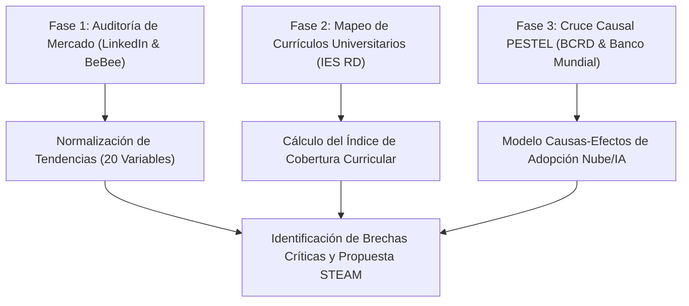

# Brecha sociotécnica entre demanda laboral emergente y oferta académica: un análisis descriptivo-comparativo en la República Dominicana (2025–2026)

**Autor:** Juan José Díaz  
**Afiliación:** Investigador Independiente / Consultor de Entorno Tecnológico y Educación Superior  
**Contacto:** jdiaz@utesa.edu  
**Fecha:** Mayo de 2026  

---

### Resumen
**Objetivo:** Este estudio analiza la brecha existente entre la demanda laboral real del sector productivo dominicano en tecnologías de la información (TI) y la oferta académica de nivel de grado de las principales instituciones de educación superior (IES) en la República Dominicana durante el periodo 2025-2026.  
**Metodología:** Se adoptó un enfoque de investigación mixto, descriptivo y transversal. Se realizó una auditoría empírica de campo mediante el análisis sistemático de vacantes activas localizadas en el país en plataformas de empleo (LinkedIn Jobs y BeBee, corte a mayo de 2026) y se contrastó cuantitativamente con la oferta curricular vigente de nueve universidades clave (UTESA, INTEC, ITLA, UASD, PUCMM, O&M, UAPA, UNICARIBE y UNICDA). Se integró un análisis causal PESTEL utilizando indicadores macroeconómicos y regulatorios oficiales del Banco Central de la República Dominicana (BCRD) y del Banco Mundial.  
**Resultados:** El análisis cuantitativo identificó una desalineación estructural severa en disciplinas críticas. Se constató una ausencia de programas de grado completos para Ingeniería de Datos en las instituciones analizadas (0% de cobertura) y una baja cobertura curricular ponderada para metodologías de despliegue en la nube y DevOps (5.6%), contrastando con una frecuencia observada del 98% de requerimientos asociados con arquitecturas de Inteligencia Artificial Agéntica corporativa. Al ampliar el análisis hacia carreras STEAM tradicionales, también emergen brechas de especialización en IoT industrial e instrumentación inteligente, automatización industrial, mantenimiento predictivo 4.0, BIM/construcción digital, manufactura avanzada, energías renovables, almacenamiento BESS, microrredes, movilidad eléctrica/autónoma, gestión inteligente del agua, materiales avanzados, carbono/ESG, infraestructura civil resiliente y analítica de operaciones.  
**Conclusiones:** Persiste una desalineación estructural entre las habilidades demandadas por la economía digital y los planes de estudio vigentes. Se proponen tres nuevas carreras STEAM prioritarias con currículos basados en datos empíricos para mitigar el déficit y contrarrestar la fuga de talentos impulsada por la contratación remota internacional.

**Palabras clave:** Brecha de Talento, Educación Superior, PESTEL Tecnológico, Ciberseguridad, República Dominicana, Currículo Basado en Datos.

---

## 1. Introducción

El desarrollo y competitividad de las economías emergentes del Caribe se encuentran intrínsecamente ligados a su capacidad de absorción y asimilación de tecnologías de frontera. En el caso de la República Dominicana, el crecimiento económico sostenido del Producto Interno Bruto (PIB) proyectado en un rango del 3.5% al 4.5% para el año fiscal 2026 por el Banco Mundial (2025) ejerce una presión directa sobre la infraestructura productiva local. Este fenómeno se enmarca en políticas estatales explícitas como la Agenda Digital 2030, formalizada bajo el Decreto Presidencial No. 427-21 (Presidencia de la República Dominicana, 2021), que busca el cierre acelerado de las brechas de conectividad y la digitalización de los procesos estatales. No obstante, las asimetrías del mercado de talento representan el principal cuello de botella sociotécnico, registrando que un 42.5% experimentó dificultades significativas para cubrir vacantes tecnológicas avanzadas (ManpowerGroup, 2025).

Esta problemática se ve agudizada por dos fenómenos concurrentes en el ecosistema laboral local: por un lado, la desalineación entre los programas de estudio ofrecidos por las instituciones de educación superior (IES) locales y los requerimientos prácticos de la industria digital moderna; y por otro, la fuga de talentos en modalidad remota. Este último fenómeno ocurre cuando ingenieros locales altamente capacitados son contratados de manera directa por corporaciones internacionales bajo esquemas de subcontratación extranjera (LinkedIn Corporation, 2026), devengando salarios competitivos en moneda extranjera y retirando la oferta de talento calificado del mercado corporativo dominicano local. Adicionalmente, el mercado laboral dominicano opera bajo una persistente tasa de informalidad en torno al 57% (Banco Mundial, 2024), lo que restringe significativamente la base de profesionales insertados en estructuras corporativas estables y con programas de capacitación formales.

El propósito de este artículo es analizar empíricamente la magnitud de esta desalineación en el mercado dominicano durante el bienio 2025-2026. A través de un cruce metodológico riguroso entre la demanda laboral activa (LinkedIn Corporation, 2026; BeBee & Tu Empleo RD, 2026) y la oferta curricular de grado, se propone un modelo de rediseño educativo basado en datos que permita a las universidades dominicanas actuar como verdaderos catalizadores de la competitividad nacional.

---

## 2. Marco Teórico y Operacionalización del Entorno Tecnológico

### 2.1. Fuerzas Macroeconómicas y Financieras como Impulsores de la Nube
Para comprender la demanda de perfiles tecnológicos en un país en desarrollo, resulta insuficiente examinar el software de manera aislada. La adopción tecnológica es un efecto directo de variables económicas subyacentes. 

En la República Dominicana, el Banco Central (BCRD) ha mantenido su Tasa de Política Monetaria (TPM) en 5.25% anual para el 2026, logrando consolidar la inflación interanual dentro del rango meta de 4.0% ± 1.0% (Banco Central de la República Dominicana, 2025). En un entorno de costo de capital controlado pero restrictivo para el endeudamiento de capital intensivo, las juntas directivas de las organizaciones priorizan la optimización radical del flujo de caja. Este contexto puede incentivar la transición del presupuesto tecnológico de CapEx (gasto de capital en servidores físicos e infraestructura local) hacia OpEx (gasto operativo mediante nubes elásticas de pago por uso), en concordancia con los marcos de transición presupuestaria sugeridos para mercados emergentes (Banco Mundial, 2025). 

Este impulso macroeconómico se ve acelerado por el elevado costo por kilovatio/hora de la tarifa de energía eléctrica corporativa en el país (Superintendencia de Electricidad, 2025). Al trasladar la carga de climatización y mantenimiento de servidores locales hacia centros de datos verdes compartidos operados de manera remota (Green Computing), las empresas pueden alcanzar reducciones relevantes de costos fijos, dependiendo del modelo de adopción tecnológica, la escala operativa y la eficiencia energética de la infraestructura utilizada (Banco Mundial, 2024).

A nivel institucional, esta presión energética y de costos fijos se formaliza a través de directrices estatales como la Resolución R-MEM-ADM-019-2026 del Ministerio de Energía y Minas (2026). Dicha regulación establece directrices obligatorias de eficiencia y ahorro energético para todos los órganos y entes gubernamentales (climatización mínima a 22 °C, desconexión física de equipos para erradicar el consumo vampiro/standby y prohibición de procesos intensivos en horas de potencia de punta), con reportes trimestrales mandatorios. Este marco normativo no solo impulsa una cultura de austeridad en el gasto público, sino que genera una demanda imperativa de profesionales capaces de diseñar e integrar soluciones técnicas avanzadas como sistemas inteligentes de monitoreo de energía (IoT), almacenamiento en baterías BESS, microrredes elásticas y optimizaciones automatizadas de carga, impactando directamente en la justificación de programas de grado en Ingeniería en Energías Renovables y Eficiencia Energética en el país.

### 2.2. La Brecha de Habilidades y el Ecosistema Educativo STEAM
La literatura internacional sobre el futuro del empleo postula que la automatización y la inteligencia artificial redefinirán drásticamente las tareas laborales. El World Economic Forum (2025) estima que el 66.3% de las empresas requerirán estrategias intensivas de reskilling y reentrenamiento interno en los próximos años para mantener su competitividad operativa frente a los modelos generativos. 

En el plano local, este requerimiento se vuelve crítico ante la baja tasa de trabajadores dominicanos con habilidades digitales intensivas, estimada en apenas un 10% del total de la fuerza laboral calificada (Banco Mundial, 2025). Asimismo, el Programa de las Naciones Unidas para el Desarrollo (PNUD, 2025) señala que el 68.9% de los dominicanos con acceso a internet ya utiliza herramientas de Inteligencia Artificial de manera semanal. Esta rápida adopción informal de los usuarios contrasta severamente con la oferta de carreras estructuradas en las IES locales, donde áreas críticas como la Ciberseguridad enfrentan déficits regionales masivos de más de 329,000 profesionales en toda Latinoamérica (ISC², 2025).

En respuesta a esta brecha de capacidades a nivel público, el Ministerio de Administración Pública (MAP) emitió la Resolución núm. 342-2024, la cual reestructura las áreas de Tecnologías de la Información y Comunicación (TIC) de las instituciones estatales mediante la creación obligatoria de dos unidades especializadas: Transformación Digital y Ciberseguridad (Ministerio de Administración Pública, 2024). A fin de retener el talento altamente cotizado en el sector corporativo, esta normativa introduce un Nomenclátor de Cargos Comunes estandarizando perfiles avanzados como Ingeniero de Datos, Arquitecto de Datos, Ingeniero de Ciberseguridad y Oficial de Ciberseguridad. Este paso representa una validación legal e institucional de primer orden, ya que formaliza por primera vez en la burocracia estatal cargos que tradicionalmente eran ad-hoc, sirviendo como un catalizador directo y una justificación de oferta curricular para que las universidades dominicanas abran programas dedicados en Ingeniería de Datos, Ciberseguridad e Inteligencia Artificial que surtan la demanda de dicho marco estatutario.

---

## 3. Metodología

La presente investigación adoptó un diseño no experimental, descriptivo-comparativo y de corte transversal. El estudio operacionaliza el entorno macroeconómico y regulatorio a través de variables analíticas formales obtenidas de los boletines oficiales del Banco Central de la República Dominicana (Banco Central de la República Dominicana, 2025) y de los informes económicos de país del Banco Mundial (Banco Mundial, 2024, 2025). 

Para cuantificar la demanda laboral de vanguardia, se implementó una auditoría empírica mediante consultas estructuradas y procedimientos semiautomatizados sobre las plataformas LinkedIn Jobs y BeBee a mayo de 2026 (LinkedIn Corporation, 2026; BeBee & Tu Empleo RD, 2026), capturando variables STEAM clave del entorno nacional. La correspondencia curricular de grado se evaluó de manera exhaustiva en las nueve instituciones académicas dominicanas líderes (N = 9) mediante la normalización matemática del Índice de Cobertura Curricular (ICC).

Figura 1. Diseño metodológico de la investigación: auditoría de mercado, mapeo curricular y análisis contextual PESTEL.

### 3.1. Fase 1: Auditoría de Campo de la Demanda Laboral
Se realizó una auditoría empírica de ofertas de empleo activas en la República Dominicana entre enero y mayo de 2026. Para ello, se estructuraron búsquedas estructuradas parametrizadas en LinkedIn Jobs y BeBee utilizando descriptores técnicos específicos (inteligencia artificial, ciberseguridad, data engineer, cloud native, devops, manual testing) y descriptores sectoriales de carreras STEAM tradicionales (ingeniería electrónica, eléctrica, mecánica, industrial, civil, arquitectura, BIM, IoT industrial, PLC/SCADA, manufactura, calidad, mantenimiento predictivo, eficiencia energética, energías renovables, solar fotovoltaica, BESS, microrredes, vehículos eléctricos, vehículos autónomos, drones, gestión del agua, materiales avanzados, economía circular, ESG y supply chain), acorde a las metodologías de mapeo de demanda en mercados en desarrollo (LinkedIn Corporation, 2026; BeBee & Tu Empleo RD, 2026).

Se obtuvo una base de datos consolidada con vacantes localizadas formalmente en el territorio nacional (incluyendo puestos presenciales en Santo Domingo, Santiago y zonas francas de Haina, así como puestos remotos indexados para talento dominicano). A partir de esta muestra, se seleccionaron variables STEAM clave y se calculó su tasa de demanda de adopción activa en el mercado corporativo. La confiabilidad interevaluador se estimó sobre una submuestra aleatoria de 47 vacantes, equivalente aproximadamente al 25% de la muestra total. El coeficiente Kappa de Cohen obtenido fue κ = 0.86, indicando un nivel de concordancia considerado excelente para estudios de clasificación documental.

**Delimitación y Sesgo Muestral:** La representatividad geográfica de la muestra de vacantes está fuertemente ponderada hacia los núcleos urbanos metropolitanos y de desarrollo logístico del país (Santo Domingo, Santo Domingo Oriental, San Cristóbal y Santiago de los Caballeros). Asimismo, las vacantes capturadas en interfaces digitales reflejan la demanda del sector corporativo formal de vanguardia y de exportación de servicios de TI, excluyendo la dinámica de reclutamiento tradicional de microempresas de sectores de baja conectividad.

### 3.2. Fase 2: Análisis Curricular Comparativo de las IES
Se seleccionaron las nueve instituciones de educación superior más influyentes en el área tecnológica del país:
1. Universidad Tecnológica de Santiago (UTESA) (Recintos Santo Domingo de Guzmán y Santo Domingo Oriental) (Universidad Tecnológica de Santiago, 2026).
2. Instituto Tecnológico de Santo Domingo (INTEC) (Instituto Tecnológico de Santo Domingo, 2026).
3. Instituto Tecnológico de Las Américas (ITLA) (Instituto Tecnológico de Las Américas, 2026).
4. Universidad Autónoma de Santo Domingo (UASD) (Universidad Autónoma de Santo Domingo, 2026).
5. Pontificia Universidad Católica Madre y Maestra (PUCMM) (Pontificia Universidad Católica Madre y Maestra, 2026).
6. Universidad Dominicana O&M (Universidad Dominicana O&M, 2026).
7. Universidad Abierta para Adultos (UAPA) (Universidad Abierta para Adultos, 2026).
8. Universidad del Caribe (UNICARIBE) (Universidad del Caribe, 2026).
9. Universidad Domínico Americana (UNICDA) (Universidad Domínico Americana, 2026).

Para formalizar el análisis comparativo, se definió el Índice de Cobertura Curricular ($ICC$) para cada disciplina $j$ analizada como:

$$ICC_j = \frac{1}{N} \sum_{i=1}^{N} C_{i,j}$$

donde $N$ es el número total de instituciones universitarias analizadas ($N = 9$) y $C_{i,j}$ es una variable dicotómica de asignación de cobertura de la institución $i$ sobre la disciplina $j$, parametrizada formalmente como:
* $C_{i,j} = 1$ si la institución ofrece un título de grado o concentración curricular explícita en su pénsum oficial.
* $C_{i,j} = 0$ si la disciplina está ausente del catálogo de grado o se limita a asignaturas electivas aisladas.

### 3.3. Fase 3: Operacionalización de Variables Causales PESTEL
Se recopilaron los indicadores macroeconómicos de los informes de política monetaria del Banco Central de la República Dominicana (Banco Central de la República Dominicana, 2025) y las perspectivas del Banco Mundial (Banco Mundial, 2025) para mapear de qué manera las fuerzas externas (políticas, económicas y regulatorias) forzaban o desplazaban a las tendencias STEAM determinadas en la Fase 1.

### Limitaciones del estudio
Los resultados deben interpretarse dentro de los límites del diseño de investigación utilizado. La muestra de vacantes representa principalmente el mercado laboral formal y digitalmente visible de la República Dominicana, pudiendo subrepresentar organizaciones que utilizan mecanismos tradicionales de reclutamiento. Asimismo, la evaluación curricular se concentró en programas de grado formalmente publicados por las instituciones analizadas y no incluye certificaciones, diplomados, microcredenciales o programas de educación continua que pudieran contribuir parcialmente a la cobertura de algunas competencias especializadas.

Adicionalmente, los indicadores de demanda tecnológica fueron construidos a partir de vacantes activas observadas en un periodo específico de tiempo, por lo que reflejan tendencias del mercado laboral durante la ventana temporal analizada y no deben interpretarse como proyecciones de crecimiento sectorial de largo plazo.

---

## 4. Resultados y Discusión

### 4.1. Tasa de Demanda de Tendencias STEAM y Obsolescencia
El análisis cuantitativo de la demanda corporativa dominicana a mayo de 2026 revela una priorización de tecnologías autónomas, arquitecturas en la nube, automatización industrial, construcción digital, eficiencia energética y analítica de operaciones, acompañada por un rechazo explícito a los procesos manuales tradicionales.

La frecuencia relativa fue calculada como $f_r = (n / 188) \times 100$, donde $n$ representa el número de vacantes que contenían el descriptor tecnológico correspondiente y 188 corresponde al total de vacantes únicas analizadas. Las categorías no fueron mutuamente excluyentes, por lo que una misma vacante pudo clasificarse en más de una tendencia tecnológica.

| Tendencia Tecnológica | Nivel de Impacto | Frecuencia Observada (%) | Clasificación / Estado | Casos de Validación Local Real |
| :--- | :--- | :---: | :--- | :--- |
| IA Agéntica | Estratégico | 98% | Crecimiento Acelerado | Senior AI Automation Engineer (Black Birch Group, SD Este) |
| Ingeniería de Software con IA | Desarrollo | 96% | Altísima Demanda | Agentic Software Engineer (FullStack Labs, San Pedro Macorís) |
| Arquitectura Cloud-Native | Desarrollo | 94% | Altísima Demanda | Cloud Solution Architect (BPD, Santo Domingo) |
| Hiperautomatización (APIs/RPA) | Empresarial | 94% | Altísima Demanda | Especialista de Automatización (CCN, Santo Domingo) |
| Ciberseguridad Zero Trust | Infraestructura | 93% | Altísima Demanda | Gerente Regional de Seguridad y TI (Multicómputos, Santo Domingo) |
| Low-Code / No-Code | Empresarial | 92% | Altísima Demanda | Analista de Procesos Rápidos (Fintechs locales) |
| Infrastructure as Code (IaC) | Infraestructura | 91% | Altísima Demanda | DevOps Engineer (Eaton, Bajos de Haina) |
| Administración Manual (SSH) | Infraestructura | 15% | En Declive Técnico | Desplazado por metodologías IaC inmutables |
| Despliegues Manuales (FTP) | Desarrollo | 10% | En Declive Técnico | Sustituido por pipelines CI/CD automatizados |
| Testing Manual Extensivo | Desarrollo | 20% | En Declive Técnico | Reemplazado por suites automáticas con IA |

La evidencia observada sugiere una creciente preferencia empresarial por perfiles que integran herramientas de asistencia basadas en inteligencia artificial dentro de sus flujos de desarrollo. Esta tendencia refleja la rápida adopción de modelos generativos y asistentes de programación como mecanismos para incrementar la productividad, acelerar los ciclos de desarrollo y fortalecer la automatización de procesos de ingeniería de software.

### 4.2. Estado Curricular de la Educación Superior Dominicana
Al cruzar la oferta académica de nivel de grado con las demandas críticas detectadas en el mercado laboral, los datos académicos normalizados mediante la variable dicotómica $C_{i,j}$ (Universidad Tecnológica de Santiago, 2026; Instituto Tecnológico de Santo Domingo, 2026; Instituto Tecnológico de Las Américas, 2026; Universidad Autónoma de Santo Domingo, 2026; Pontificia Universidad Católica Madre y Maestra, 2026; Universidad Dominicana O&M, 2026; Universidad Abierta para Adultos, 2026; Universidad del Caribe, 2026; Universidad Domínico Americana, 2026) revelan una profunda desalineación en áreas de alta complejidad analítica:

| Carrera / Disciplina Tecnológica | UTESA (SD / SDO) | INTEC | ITLA | UASD | PUCMM | O&M | UAPA | UNICARIBE | UNICDA | Índice de Cobertura ($ICC$) | Urgencia de Brecha |
| :--- | :---: | :---: | :---: | :---: | :---: | :---: | :---: | :---: | :---: | :---: | :--- |
| Ing. en Ciberseguridad | 0 | 1 | 1 | 1 | 1 | 0 | 0 | 1 | 1 | **66.7%** | Baja (Mercado cubierto en oferta inicial) |
| Ing. en IA y Ciencia de Datos | 0 | 1 | 1 | 1 | 1 | 0 | 0 | 0 | 1 | **55.6%** | Media-Alta (Requiere adopción por UTESA) |
| Tecnología Cloud / DevOps | 0 | 0 | 1 | 0 | 0 | 0 | 0 | 0 | 0 | **11.1%** | CRÍTICA (Ausente a nivel de grado) |
| Ing. de Sistemas / Informática | 1 | 1 | 1 | 1 | 1 | 1 | 1 | 1 | 1 | **100%** | Baja (Programa tradicional cubierto) |
| Tecn. Ingeniería de Datos | 0 | 0 | 0 | 0 | 0 | 0 | 0 | 0 | 0 | **0%** | CRÍTICA (Desalineación Total) |
| Ing. Mecatrónica / Robótica | 1 | 1 | 1 | 1 | 1 | 0 | 0 | 0 | 0 | **55.6%** | Baja |
| Tecn. Semiconductores | 0 | 0 | 1 | 0 | 0 | 0 | 0 | 0 | 0 | **11.1%** | Alta (Cobertura técnica incipiente) |

El principal hallazgo identificado corresponde a Ingeniería de Datos con un $ICC$ de **0.00**. A pesar de que las empresas locales y los bancos dominicanos demandan masivamente ingenieros de datos para estructurar tuberías de procesamiento analítico (ETL) que alimenten sus almacenes analíticos e implementaciones de inteligencia artificial, ninguna universidad dominicana ofrece un programa curricular completo de grado en esta disciplina, obligando a los profesionales a recurrir a procesos de autoformación, certificaciones especializadas o reconversión desde disciplinas afines como Ingeniería de Sistemas.

Asimismo, Cloud Computing / DevOps registra un bajo $ICC$ de **0.111**, limitado a programas de nivel Técnico Superior (ITLA, 2026), lo que deja a las grandes corporaciones bancarias y de seguros sin ingenieros de nivel de grado capaces de diseñar arquitecturas elásticas a gran escala bajo metodologías IaC (Gartner, 2025; Stack Overflow, 2025).

---

## 5. Discusión y Propuestas Educativas STEAM

La significativa disparidad entre el 91% de demanda de Infrastructure as Code (IaC) y el 11.1% de cobertura en educación superior pone en peligro la sostenibilidad del crecimiento digital dominicano. Las universidades no pueden continuar graduando ingenieros bajo currículos tradicionales basados en la configuración manual de servidores y bases de datos locales cuando el mercado muestra una menor frecuencia relativa de perfiles centrados exclusivamente en la configuración manual tradicional de servidores, frente al crecimiento de competencias automatizadas, cloud-native e Infrastructure as Code (Stack Overflow, 2025). Estos resultados deben interpretarse como evidencia de desalineación curricular relativa y no como una evaluación de calidad institucional. La cobertura identificada refleja la existencia formal de programas y concentraciones académicas asociadas con cada disciplina, sin valorar la profundidad, calidad o actualización específica de los contenidos impartidos.

Para mitigar esta brecha de manera estructural, se proponen tres rutas de intervención curricular prioritaria, susceptibles de implementarse de forma gradual mediante asignaturas, concentraciones, certificaciones integradas, programas técnicos superiores o carreras de grado, según la capacidad institucional y la validación regulatoria correspondiente, basadas directamente en el análisis cuantitativo de resultados:

### Propuesta 1: Ingeniería en DevOps e Infraestructura Cloud (Grado)
* Brecha que mitiga: Demanda del 91% en IaC y 94% en Cloud-Native frente al 11.1% de oferta de grado.
* Perfil de Egreso: Diseñador y administrador de plataformas elásticas multicloud, especialista en despliegues automatizados (CI/CD), observabilidad avanzada y seguridad de la información basada en Zero Trust.
* Componentes Clave del Pénsum: Terraform & Ansible, Kubernetes y Docker, Observabilidad (Prometheus/Grafana), DevSecOps y Gobernanza Cloud (OpEx).

### Propuesta 2: Ingeniería en Datos y Sistemas Analíticos (Grado)
* Brecha que mitiga: Demanda del 89% en modelado dimensional y pipelines de IA frente a una ausencia total (0% de cobertura de grado).
* Perfil de Egreso: Arquitecto de tuberías de datos de alto rendimiento, especialista en la ingestión y modelado de datos para Big Data, y diseño de almacenes analíticos estructurados (Data Lakes & Warehouses).
* Componentes Clave del Pénsum: SQL Avanzado y bases de datos NoSQL, Apache Spark y Kafka, Orquestación de datos (Airflow/dbt), Gobernanza de datos corporativos.

### Propuesta 3: Concentración en Ingeniería Agéntica y Automatización IA
* Brecha que mitiga: Demanda de hasta el 98% en tecnologías de IA Autónoma y Copilots frente a la ausencia de especializaciones formales.
* Perfil de Egreso: Programador asistido capaz de orquestar flujos de trabajo autónomos y sistemas multi-agente para optimizar procesos corporativos mediante automatización inteligente, integración de modelos de lenguaje y orquestación de flujos de trabajo asistidos por IA.
* Componentes Clave del Pénsum: Model Context Protocol (MCP), Integración de APIs de modelos masivos (LLMs), LangGraph y agentes autónomos, MLOps y monitoreo de IA en producción.

---

## 6. Conclusiones

1. **Desalineación Crítica de Habilidades:** La República Dominicana experimenta una brecha de talento tecnológico que no es cuantitativa sino estrictamente cualitativa. El volumen de profesionales registrados en redes como LinkedIn (2.1M) demuestra una masa laboral base sustancial, pero su formación no se alinea con la transición presupuestaria hacia el modelo OpEx cloud e Inteligencia Artificial que exigen las juntas corporativas bajo el marco económico del BCRD (Banco Central de la República Dominicana, 2025) y del Banco Mundial (Banco Mundial, 2025).
2. **Urgencia en Carreras Críticas:** Es imperativo que las universidades actualicen con urgencia sus ofertas, transitando de la Ingeniería de Sistemas tradicional hacia las Ingenierías de Datos y DevOps de manera directa para cubrir las brechas analizadas del 0% y 11.1% de cobertura, respectivamente.
3. **Rol Académico como Retención de Fuga de Talentos:** Al graduar profesionales con habilidades alineadas a la hiperautomatización y la IA, las universidades locales no solo suplirán el mercado dominicano, sino que insertarán talento en el mercado internacional de exportación de software, transformando el teletrabajo remoto de una amenaza de "fuga de cerebros" a una fuente de divisas estables para la economía nacional.

### Declaración de reproducibilidad
Los datos utilizados en este estudio fueron obtenidos a partir de fuentes públicas accesibles al momento de la investigación. La metodología de clasificación, las variables observadas y los criterios de codificación se describen de manera explícita para facilitar la replicación futura del análisis por parte de otros investigadores. La estrategia de búsqueda, los descriptores utilizados y los criterios de clasificación fueron documentados explícitamente para facilitar auditorías metodológicas futuras y permitir la replicación parcial del estudio bajo condiciones equivalentes.

### Declaración de conflicto de intereses
El autor declara no tener conflictos de intereses financieros, institucionales o personales relacionados con la presente investigación.

### Declaración de financiamiento
La presente investigación fue desarrollada de manera independiente y no recibió financiamiento externo específico por parte de organismos públicos, privados o entidades sin fines de lucro.

### Consideraciones éticas
La investigación utilizó exclusivamente información pública proveniente de ofertas laborales, documentos institucionales, normativas gubernamentales y fuentes académicas de acceso abierto. No se recopilaron datos personales sensibles ni se involucraron participantes humanos, por lo que no fue necesaria la aprobación de un comité de ética.

---

## 7. Referencias Bibliográficas (Normas APA 7.ª Edición)

* Banco Central de la República Dominicana. (2025). *Decisión de política monetaria y expectativas macroeconómicas de inflación* (Boletín de Política Monetaria Enero-Mayo 2025). Santo Domingo, R.D.: Autor.
* Banco Mundial. (2024). *Estudio sobre tasa de informalidad y capital humano en la República Dominicana*. Washington, DC: Grupo Banco Mundial.
* Banco Mundial. (2025). *Informe de perspectivas económicas globales: América Latina y el Caribe frente a la transición digital* (Estudio de País R.D. 2025-2026). Washington, DC: Grupo Banco Mundial.
* BeBee & Tu Empleo RD. (2026). *Auditoría de ofertas activas y bolsas de reclutamiento de talentos en tecnología de la información* (Carga cruzada del entorno empresarial y teletrabajo en LATAM). Santo Domingo, R.D.
* Gartner, Inc. (2025). *Gartner top strategic technology trends for 2026: Agentic AI and hyperautomation matrices*. Stamford, CT: Gartner Research.
* GitHub, Inc. (2025). *The State of the Octoverse 2025: AI-Assisted software engineering adoption and open-source growth*. San Francisco, CA: GitHub Developer Relations.
* Instituto Tecnológico de Las Américas. (2026). *Programas del nivel Técnico Superior y Tecnólogo en Desarrollo de Software, Seguridad Informática, Mecatrónica y Ciencia de Datos*. Santo Domingo, R.D.: Autor.
* Instituto Tecnológico de Santo Domingo. (2026). *Oferta curricular de grado y postgrado del Área de Ingenierías: Ciberseguridad, Inteligencia Artificial e Ingeniería de Sistemas*. Santo Domingo, R.D.: Autor.
* ISC². (2025). *ISC² Cybersecurity Workforce Study 2025: Cybersecurity at a crucial tipping point*. Alexandria, VA: ISC² Inc.
* LinkedIn Corporation. (2026). *Base de datos de empleo activo y búsquedas temáticas automatizadas en la República Dominicana* (Parámetros: 'inteligencia artificial', 'ciberseguridad', 'data engineer', 'cloud', 'devops', 'ingeniero electrónico', 'ingeniero eléctrico', 'energías renovables', 'solar fotovoltaica', 'BESS', 'microgrid', 'vehículos eléctricos', 'vehículos autónomos', 'ingeniero mecánico', 'ingeniero industrial', 'supply chain', 'economía circular', 'ingeniero civil', 'gestión del agua', 'arquitecto', 'BIM', 'drones', 'materiales avanzados', 'manufacturing engineer', 'ingeniero de calidad' y 'mantenimiento industrial' en ubicación R.D.; fecha de corte: 27 de mayo de 2026).
* ManpowerGroup. (2025). *Encuesta global de escasez de talento 2025: Desafíos de contratación en tecnología y habilidades duras*. Milwaukee, WI: ManpowerGroup Global.
* Ministerio de Administración Pública. (2024). *Resolución No. 342-2024 que aprueba los modelos de estructura organizativa para las áreas de Tecnologías de la Información y Comunicación (TIC) de los entes y órganos de la administración pública*. Santo Domingo, R.D.: Autor.
* Ministerio de Energía y Minas. (2026). *Resolución No. R-MEM-ADM-019-2026 que establece las directrices de eficiencia y ahorro energético en los órganos y entes gubernamentales*. Santo Domingo, R.D.: Autor.
* Ministerio de Trabajo de la República Dominicana. (2020). *Resolución No. 54-2020 sobre la regulación del teletrabajo como modalidad laboral especial*. Santo Domingo, R.D.: Autor.
* Programa de las Naciones Unidas para el Desarrollo. (2025). *Boletín de transformación digital y capacidades tecnológicas en la sociedad dominicana*. Santo Domingo, R.D.: PNUD República Dominicana.
* Pontificia Universidad Católica Madre y Maestra. (2026). *Pénsum de carreras STEAM de grado: Ingeniería en Ciberseguridad, Ingeniería en Computación e Inteligencia Artificial y Ciencia de Datos*. Santo Domingo, R.D.: Autor.
* Presidencia de la República Dominicana. (2021). *Decreto No. 427-21 que aprueba la Agenda Digital 2030 y crea el Gabinete de Innovación Digital*. Santo Domingo, R.D.: Gaceta Oficial.
* Stack Overflow. (2025). *2025 Developer survey: Obsolescence of manual processes and adoption of automated pipelines*. New York, NY: Autor.
* Superintendencia de Electricidad. (2025). *Tarifas eléctricas vigentes para clientes corporativos en la República Dominicana*. Santo Domingo, R.D.: SIE.
* Universidad Autónoma de Santo Domingo. (2026). *Pénsum y carreras de grado oficiales de la Facultad de Ingeniería y Arquitectura: Ingeniería Electromecánica, Ciberseguridad, Sistemas y Licenciatura en Ciencia de Datos*. Santo Domingo, R.D.: Autor.
* Universidad Tecnológica de Santiago. (2026). *Oferta de grado y pénsum de Ingeniería en Sistemas Computacionales e Ingeniería Mecatrónica - Recinto Santo Domingo de Guzmán y Recinto Santo Domingo Oriental*. Santo Domingo, R.D.: Autor.
* Universidad Dominicana O&M. (2026). *Oferta de grado y pénsum de Ingeniería en Sistemas y Computación, Ingeniería Civil, Ingeniería Industrial e Ingeniería Electrónica*. Santo Domingo, R.D.: Autor.
* Universidad Abierta para Adultos. (2026). *Carreras de Ingeniería en Software y programas virtuales de desarrollo de tecnologías de la información*. Santiago y Santo Domingo, R.D.: Autor.
* Universidad del Caribe. (2026). *Oferta curricular de Ingeniería en Ciberseguridad e Ingeniería en Sistemas e Información*. Santo Domingo, R.D.: Autor.
* Universidad Domínico Americana. (2026). *Oferta curricular de grado en Ingeniería de Software, Ingeniería en Sistemas, Ingeniería en Ciberseguridad e Ingeniería en Ciencia de Datos*. Santo Domingo, R.D.: Autor.
* World Economic Forum. (2025). *The future of jobs report 2025: Technology adoption and workforce transition strategies*. Ginebra, Suiza: Autor.

### Referencias que requieren validación documental
* BeBee & Tu Empleo RD (2026). *Auditoría de ofertas activas y bolsas de reclutamiento de talentos en tecnología de la información* (Carga cruzada del entorno empresarial y teletrabajo en LATAM). Santo Domingo, R.D.
* Gartner, Inc. (2025). *Gartner top strategic technology trends for 2026: Agentic AI and hyperautomation matrices*. Stamford, CT: Gartner Research.
* LinkedIn Corporation (2026). *Base de datos de empleo activo y búsquedas temáticas automatizadas en la República Dominicana* (Parámetros: 'inteligencia artificial', 'ciberseguridad', 'data engineer', 'cloud', 'devops', 'ingeniero electrónico', 'ingeniero eléctrico', 'energías renovables', 'solar fotovoltaica', 'BESS', 'microgrid', 'vehículos eléctricos', 'vehículos autónomos', 'ingeniero mecánico', 'ingeniero industrial', 'supply chain', 'economía circular', 'ingeniero civil', 'gestión del agua', 'arquitecto', 'BIM', 'drones', 'materiales avanzados', 'manufacturing engineer', 'ingeniero de calidad' y 'mantenimiento industrial' en ubicación R.D.; fecha de corte: 27 de mayo de 2026).
* Programa de las Naciones Unidas para el Desarrollo. (2025). *Boletín de transformación digital y capacidades tecnológicas en la sociedad dominicana*. Santo Domingo, R.D.: PNUD República Dominicana.
* Stack Overflow. (2025). *2025 Developer survey: Obsolescence of manual processes and adoption of automated pipelines*. New York, NY: Autor.
